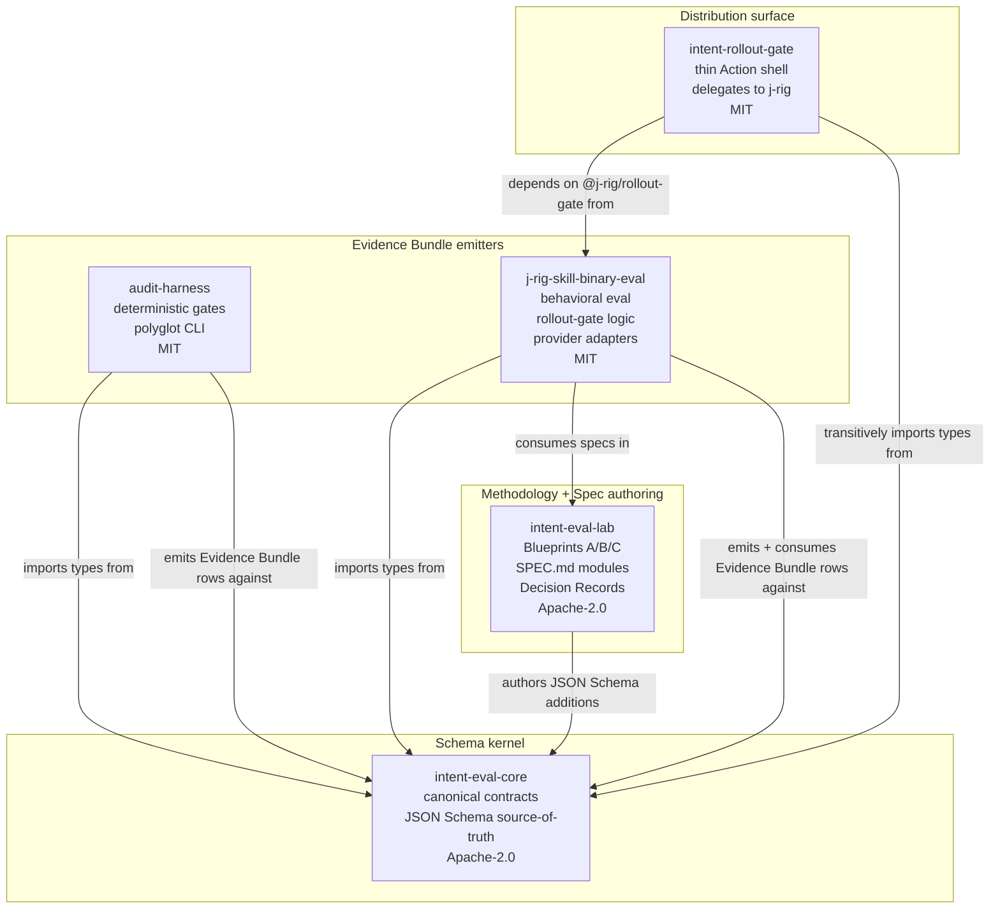
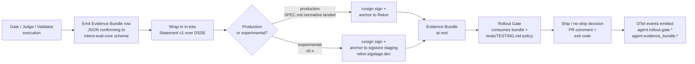
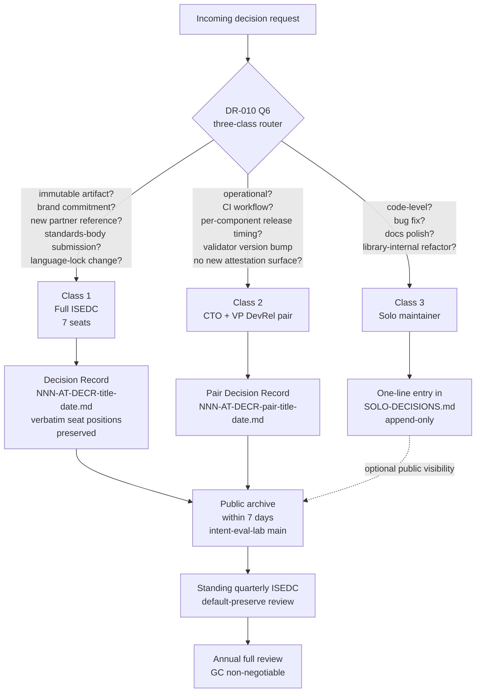

# Ecosystem Master Blueprint — Intent Eval Platform

> **This document is the constitution.** Every repo blueprint (Blueprint C), every per-repo CLAUDE.md, every Decision Record, and every release of every constituent repo in the Intent Eval Platform inherits from the principles, taxonomy, governance, anti-goals, and engineering standards locked in this document. Drift from this document is detectable, recoverable, and adjudicated through the governance routing described in § 2.3.

## 0. How to read this document

Blueprint A locks the **shape** of the ecosystem: what it is, what it is not, who decides what, and what every repo agrees to. It is intentionally short on implementation detail — the kernel specification (Blueprint B, `012-AT-ARCH-platform-runtime-blueprint.md`) carries the canonical domain model and runtime architecture, and per-repo blueprints (Blueprint C applied) carry implementation specifics. This separation is itself a binding principle: the constitution is the place to disagree about scope, principles, and anti-goals; the kernel and per-repo blueprints are the place to disagree about implementation.

When this document and any downstream document conflict, **this document wins** until the conflict is resolved through a Decision Record per the governance routing in § 2.3. If a contributor reads this document and disagrees with a binding, the path forward is to file a Decision Record proposing an amendment — not to deviate in implementation.

The authority chain is explicit: this blueprint is bound by DR-010 (ISEDC Session 4, the widened-scope architectural lock), which is bound by user directive (acting head of board, 2026-05-13), which carries the two override addenda (§ 13.5 customer-signal removal + § 13.6 external-pattern non-borrow). Prior binding decisions from DR-004 (Session 1, 5 binding constraints) and DR-006 (Session 3, Phase B gate, lifted) are preserved through DR-010 § 10's reopened-bindings register.

---

## 1. Mission + Ecosystem Principles

### 1.1 Mission

The Intent Eval Platform is **deterministic evaluation, replayable execution, audit-grade evidence, and rollout governance for AI infrastructure — narrowed to Claude Code Skills and MCP ecosystems as the wedge**. It is an internal tool built for the acting head of board's own engineering practice and shared with the world as an OSS artifact (DR-010 § 13.6 Part A clarification).

The strategic wedge — narrow and defensible — is *"deterministic evaluation + rollout gates for Claude Code Skills and MCP ecosystems"* (parent plan § "The strategic wedge"). The wedge wins on credibility (the existing 45,000+ NPM `claude-code-plugins` audience, 2,000+ GitHub stars), datasets (operational skill-failure data from the OSS distribution), and operational scars (failure modes already encountered and instrumented). The expansion path *from* the wedge is replay engine → regression engine → rollout governance → deterministic validation → audit infrastructure → broader AI runtime governance over time. The wedge is **not** "AI evaluation platform for everyone." It is "deterministic evaluation and rollout governance for the surfaces I already understand, distributed naturally through the channels I already have."

### 1.2 Ecosystem principles

The following 12 principles are **binding** on every repo in the ecosystem. Each is followed by a justification and, where applicable, the originating Decision Record or parent-plan addendum. A repo or contribution that violates a principle is out of compliance and must be reconciled through the governance routing in § 2.3 — not silently merged.

1. **Deterministic > probabilistic.** Every gate, judge, validator, and rollout decision in the platform produces a deterministic, reproducible output for a fixed input — or declares the boundary at which determinism breaks (e.g., probabilistic judges) explicitly in the Evidence Bundle row it emits. Non-determinism is permitted at the leaf (probabilistic LLM-as-judge), forbidden at the spine (decision aggregation, exit-code grammar, signing).

2. **Replayability mandatory.** Every execution that produces an Evidence Bundle row is replayable to the level declared by its predicate type. The replay level is enumerated per predicate (gate-result, validation-result, eval-verdict, cost-attribution) and is part of the predicate's normative specification. Replay declarations are part of the kernel's canonical contracts in `intent-eval-core` per the parent plan § "REPO 1 — intent-eval-core."

3. **Evidence append-only.** Evidence Bundle rows are never amended in place. Corrections happen by signing a new row that references the prior row's content-address. The envelope is in-toto Statement v1 over DSSE per DR-010 Q3 unification thesis. Production-Rekor signing is gated on the originating predicate's SPEC.md normative section landing (DR-010 § 7 Q5 CISO non-negotiable).

4. **Rollbacks always possible.** Every promotion to a higher-trust state (e.g., a Rollout Gate passing a Skill Snapshot for production use) carries a corresponding rollback path. Skill Snapshots are SHA-pinned and immutable; rollback is "switch the pin back" — never "edit history." This principle is what makes the Rollout Gate's ship/no-ship output safe to act on.

5. **Regression packs immutable.** A Regression Pack is a frozen historical benchmark captured against a specific Skill Snapshot at a specific moment for a specific reason. Once committed, it is never mutated. New regression evidence becomes a new Regression Pack referencing its ancestor — analogous to git commits over file edits. This is what makes one-variable-change discipline (principle 6) detectable.

6. **One-variable changes preferred.** When evaluating a delta (new skill version vs prior, new model vs prior, new prompt vs prior), one variable changes at a time wherever bandwidth permits. Multi-variable changes are permitted but must declare the multi-variable nature in the Evidence Bundle row's `delta` field so downstream consumers (Rollout Gate, dashboards) treat the verdict accordingly. The discipline exists because permuted multi-variable runs cannot causally attribute outcome shifts.

7. **Auditability first.** Every decision the platform makes is traceable back to its inputs, its decision rule, its predicate URI, and its signing identity. The audit trail is the product. If a feature cannot produce an auditable Evidence Bundle row, the feature is incomplete. This principle is what makes the platform legible to enterprise reviewers, partner counsel, and future ISEDC convenings without re-archaeology.

8. **Cost ceilings matter.** Every evaluation, replay, and gate execution declares its expected token cost, wall-clock, and external-API spend in the EvalSpec, and emits actual usage in the Evidence Bundle's `cost-attribution` row. Loop budgets are bounded (no infinite agentic recursion). Cost ceilings are enforced at the runtime sandbox boundary (Blueprint B § Runtime isolation), not at the policy layer alone.

9. **Sandboxed runtimes.** Every artifact under evaluation runs in an isolated execution environment with declared filesystem, network, and credential boundaries. Provider credentials never cross into user code or evaluated-artifact code without going through a credential broker that enforces redaction and env-var spillover gates (DR-004 S1Q5 + DR-010 § 7 Q5 CISO non-negotiable — explicitly declined reopening at Session 4).

10. **Schema is canon.** Every validator, gate, judge, and runtime in the ecosystem emits Evidence Bundle rows as architectural primitive (DR-010 § 7 Q3 unanimous binding — unification thesis). The canonical type definitions live in `intent-eval-core` as JSON Schema; Zod (TS) and Pydantic (Python) bindings are codegen'd, never hand-maintained. Drift between language bindings is a CI gate failure, not a discussion item.

11. **Decoupled distribution from publishing.** Every release artifact in the ecosystem (npm package, GitHub Release, PyPI wheel, GitHub Action) confirms successful *publish* through an out-of-band check — not just successful local *write*. This principle exists because of an observed failure mode in adjacent tooling where local write succeeded but downstream propagation failed silently, producing the most expensive class of bug (drift that looks like success). Every CI pipeline in the ecosystem treats "the artifact is readable from its public URL by an unauthenticated client" as the definition of done, not "the publish command exited 0."

12. **Adversarial integrity.** Architectural decisions are adjudicated through the ISEDC pattern (parent plan + `~/.claude/skills/exec-decision-council/SKILL.md`). Dissent is preserved verbatim in Decision Records, not suppressed. Minority binding constraints stack on majority recommendations. Future readers reconstruct *why* a decision landed where it did, not only *what* the decision was. This is the meta-principle: it is what lets the platform's other principles evolve correctly under pressure.

---

## 2. Repo Taxonomy + Governance Philosophy

### 2.1 The 5-repo target

The ecosystem is composed of five public OSS repositories, each independently versioned and licensed, coupled through the shared schema kernel rather than through package consolidation. There is no monorepo. There is no shared build system. There is no shared CI. The coupling lives at the schema layer; everything else is per-repo.

| Repo | Role | License | Status | Bead prefix |
|---|---|---|---|---|
| `intent-eval-core` | Canonical contracts kernel — types, schemas, lifecycle state machines, replay semantics, evidence semantics, failure taxonomy, UUID/event standards. **No execution, no judges, no deployment logic.** Pure types. Imported by all other repos. | Apache-2.0 | NEW — created at `iec-E01a` per parent plan Phase 0 | `iec-` |
| `intent-eval-lab` | Methodology + specification authoring — Blueprints A/B/C live here, canonical glossary lives here, normative SPEC.md modules live here under `specs/`. Sandbox for experiments. Public Decision Record archive. | Apache-2.0 | EXISTING | `iel-` |
| `audit-harness` | Deterministic gates — escape-scan, CRAP, architecture, harness-hash, bias-count, gherkin-lint. Already polyglot (Node CLI + shell + Python). Emits Evidence Bundle gate-result rows. | MIT | EXISTING | `iah-` |
| `j-rig-skill-binary-eval` | Behavioral evaluation harness + Rollout Gate decision logic + provider adapters + regression packs. TS pnpm monorepo. Emits + consumes Evidence Bundle rows. The decision engine lives here. | MIT | EXISTING (expanding scope) | `iaj-` |
| `intent-rollout-gate` | **Thin GitHub Action shell** that delegates all decision logic to `@j-rig/rollout-gate`. The repo's role is the Action surface (action.yml + dist/index.js + npm-publishable Action variant). M4 v0.0.0 substantive-bootstrap tag preserved; adopters keep their pins; v0.1.0+ implements the shell. | MIT | EXISTING (scope narrows to shell-only) | `iar-` |

The split was decided at ISEDC Session 4 (DR-010 Q1=A, single converged Intent Eval Platform with internal scope-map under it) and refined in parent-plan Addendum #3 ("5-repo target") in response to the user's "we want a whole ecosystem, we can do what we want" reminder. The earlier four-repo framing was tightened by archiving `intent-rollout-gate`; the revised five-repo framing preserves it as a thin distribution surface to honor the existing adopter pin and avoid a Plane re-anchor.

### 2.2 Dependency graph

The schema kernel sits at the center. Methodology authoring (`intent-eval-lab`) feeds normative specifications into the kernel as JSON Schema additions. Gate emitters (`audit-harness`) and behavioral-eval + decision-logic (`j-rig-skill-binary-eval`) import types from the kernel and emit Evidence Bundle rows against the kernel's canonical contracts. The Action shell (`intent-rollout-gate`) depends on `@j-rig/rollout-gate` (which itself depends on the kernel). The methodology repo is the only one that depends on no other ecosystem repo — it is the spec-authoring surface, by design.

See § 5.1 for the Mermaid diagram of this graph.

### 2.3 Governance philosophy — DR-010 Q6 three-class routing

Decisions in the ecosystem are routed through three classes. The class determines who must be at the table, the artifact produced, and the cadence at which the decision is reviewed.

**Class 1 — Full ISEDC (7 seats).** Decisions producing immutable artifacts or commitments. The trigger list:

- New predicate URI subtype reservation
- DNS zone change at any predicate-URI subdomain
- New Fulcio identity issuance or signing key custody change
- DSSE attestation envelope schema change
- New brand commitment with public surface (repo rename, npm scope rename, new domain registration)
- New partner-engagement public reference (the vendor-generic case-study scrub binding from DR-004 S1Q2 stays in force)
- Standards-body submission (OTel SIG-GenAI, in-toto, SLSA, CNCF, OpenSSF)
- New sub-platform initiation (DR-010 Q1 reaffirmation: no new platform initiation in next 6 months per Q5 bandwidth math)
- Language-lock changes (DR-010 Q2 reaffirmation)

Artifact: full Decision Record (`NNN-AT-DECR-<title>-<date>.md`) per Document Filing Standard v4.3, with verbatim seat positions preserved per ISEDC adversarial-integrity protocol. Public archive within 7 days of decision-lock on `intent-eval-lab` main branch (VPDevRel non-negotiable floor, DR-010 § 7 Q6).

**Class 2 — CTO + VP DevRel pair (2 seats).** Operational decisions, tooling choices, per-component release timing, CI workflow changes, validator additions or version bumps (when no new emitted-attestation surface is introduced), Saturday-afternoon-dev friction-reduction passes, tooling internal architecture below the predicate-URI line.

Artifact: short pair Decision Record (`NNN-AT-DECR-pair-<title>-<date>.md`). Public archive within 7 days same as Class 1.

**Class 3 — Solo maintainer (acting head of board).** Code-level decisions inside an existing sub-component's scope, bug fixes, documentation polish, library-internal refactors.

Artifact: one-line entry in `intent-eval-lab/000-docs/SOLO-DECISIONS.md` (append-only).

**Cadence:**

- **Standing quarterly ISEDC** — default-preserve review of prior bindings; reopening any binding requires justification.
- **Ad-hoc Class 1 convening** — triggered by any auto-trigger in the list above.
- **Annual full review** of all active bindings (GC non-negotiable, DR-010 § 7 Q6).

**Convening standing:**

- Acting head of board has unilateral standing to convene.
- Any 2 seats acting jointly may call ad-hoc Class 1 convening.
- VP DevRel has unilateral standing to call community-temperature Class 1 convenings (DevRel seat compromise from DR-010).

**Bandwidth gate:** Quarterly + ad-hoc convening capped at approximately 12 founder-hours/year governance overhead (CFO bandwidth gate, DR-010 § 7 Q6). Exceeding the gate triggers re-scope, not silent over-budget.

---

## 3. Anti-Goals (BINDING SCOPE CONTROL)

The anti-goals are **co-equal to the goals**. Scope-creep into any anti-goal triggers ISEDC re-convene per DR-010 Q6 Class-1 routing. Future contributors and future ISEDC convenings inherit these anti-goals with the same force as the principles in § 1.2.

The anti-goals exist because the strategic wedge (parent plan § "The strategic wedge") is narrow on purpose. The platform's defensibility comes from the narrowness. Every anti-goal below corresponds to a specific failure mode the wedge prevents.

### 3.1 NOT a generalized autonomous agent platform

The Intent Eval Platform does not compete with general-purpose agent orchestration platforms. Its scope is **evaluation, governance, and audit of agent + skill + MCP-server artifacts** — not the runtime that hosts production agentic workloads end-to-end. Specifically, this platform does not aim to provide:

- A general agent-construction framework analogous to graph-based agent SDKs or multi-agent role-playing frameworks
- A planner / executor / memory loop that other developers build their primary agent on top of
- A managed agent runtime that competes with hosted agent products

Failure mode prevented: **brand blur.** If the platform tries to be both a deterministic evaluator AND a general agent runtime, the brand collapses into "yet another agent thing" and the wedge defensibility evaporates.

### 3.2 NOT a workflow automation competitor (NOT Zapier)

The platform is not a no-code or low-code workflow automation tool. It does not aim to let non-engineers stitch together SaaS APIs into business workflows. The audience is engineers, the surface is CLI + GitHub Action + machine-readable evidence — not a visual workflow builder.

Failure mode prevented: **audience misalignment.** The 45,000+ NPM `claude-code-plugins` audience is engineers who build with skills and MCP servers. Pivoting toward a workflow-automation audience abandons the existing distribution channel for one where the platform has no credibility.

### 3.3 NOT a distributed compute platform

The platform's deployment philosophy is explicitly **modular monolith** (Blueprint B § Deployment philosophy, per DR-010-referenced parent plan). It does not aim to provide distributed messaging, distributed transactions, multi-region replication, service mesh, Kubernetes orchestration, CQRS, or event-sourced microservices. The platform runs PostgreSQL + Redis + background workers + object storage + OpenTelemetry — and explicitly defers everything beyond.

Failure mode prevented: **architecture theater.** Premature distributed-systems complexity in a single-maintainer + intermittent-contributor context produces a code surface that nobody can operate on a Saturday afternoon. The parent plan's directive is explicit: *"you have not earned those yet."*

### 3.4 NOT a no-code builder

There is no visual builder. There is no "drag a gate onto a canvas." Every artifact (EvalSpec, RegressionPack, RolloutGate policy, SkillSnapshot pin) is defined in versionable text, lives in git, and is reviewable as a diff. The audience is engineers who already operate with `pnpm`, `git`, and CI configuration.

Failure mode prevented: **scope drift toward design-tool engineering.** Visual builders are entire products, and they multiply the surface area of bugs, accessibility commitments, browser compatibility commitments, and design-system commitments — none of which advance the deterministic-evaluation wedge.

### 3.5 NOT infinite orchestration

The platform bounds execution explicitly. Loop budgets are enforced. Cost ceilings are enforced. Wall-clock timeouts are enforced. Recursive evaluation (an evaluator evaluating an evaluator) is bounded at a documented depth. The platform does not aim to support arbitrary-depth agentic recursion as a feature; it aims to make the bounding *explicit*, *attestable*, and *replayable*.

Failure mode prevented: **bandwidth collapse.** Unbounded orchestration is a research problem with a multi-million-dollar compute budget elsewhere. In a 3-5 hrs/wk solo-maintainer context (CFO bandwidth math, DR-010 § 7 Q5), unbounded orchestration is an indistinguishable-from-broken feature.

### 3.6 NOT trying to be the union of every adjacent category

The platform is **not** trying to simultaneously occupy the categories of every adjacent system: observability platforms with agent-tracing capability, monitoring platforms with LLM cost tracking, CI runners with AI-eval awareness, telemetry-conventions efforts at standards bodies, evaluation frameworks for production LLM workloads, MCP-server orchestration tools, CI infrastructure, and managed agent runtime in one product. Each of those is its own product with its own team and its own decade of accumulated muscle memory.

The platform is, narrowly: *"deterministic evaluation + rollout gates for Claude Code Skills and MCP ecosystems"* (parent plan § "The strategic wedge"). It interoperates with observability, telemetry, and CI by emitting standard envelopes (in-toto Statement v1, DSSE, OpenTelemetry semantic-conventions extensions per the iel-E12 RFC) — not by replacing them.

Failure mode prevented: **strategic incoherence.** Trying to be the union of every adjacent category produces a product that no decision-maker can place. The wedge is the placement.

### 3.7 AISE 5-domain stack is internal scope-map, NOT separate-brand surface

The modern AI Systems Engineer 5-domain stack (Inference Engineering, Reliability Engineering, Evaluation Science, Agent Systems, LLMOps) was absorbed at DR-010 Q1=A as the **internal scope map** — not as separate branded sub-platforms. The widening directive was *fold-in, not multiply*.

The platform's product positioning at the umbrella is *"Reliability infrastructure for agentic systems. Not chatbots. Not wrappers. Infrastructure."* (user-named at DR-010). The 5 AISE domains map to internal sub-scopes inside the platform, addressed via predicate URI sub-types under `evals.intentsolutions.io/<predicate-type>/v<version>` — never via separate-brand subdomains or separate-brand npm scopes.

Two named **future** platforms — LLM Harness Lab and Agent Runtime Sandbox — are catalogued in `FUTURE.md` per DR-010 § 13.5 Q5 stacked binding as *design-doc-only, bandwidth-gated*. They are not current-state commitments. They are not in any current-state planning beyond the FUTURE.md placeholder. Initiation of either as an actual build is a Class-1 ISEDC trigger (§ 2.3 above) — see DR-010 Q1 reaffirmation: no new platform initiation in next 6 months per Q5.

Failure mode prevented: **brand multiplication.** Three or five sub-brands at 3-5 hrs/wk is the loudest negative-signal in OSS distribution per the DR-010 VPDevRel position.

---

## 4. Shared Terminology + Engineering Standards

### 4.1 Shared terminology

The canonical glossary lives at `014-DR-GLOS-canonical-glossary.md` (epic `iel-E03`, authored next). Every doc in the ecosystem that uses platform-specific terminology must either define the term inline or link to the glossary. For Blueprint A's purpose, the following load-bearing terms are defined here so the constitution stands on its own:

- **Evidence Bundle** — the lingua franca of the platform (DR-010 § 7 Q3 unification thesis). A structured row emitted by every validator, gate, judge, and runtime in the ecosystem, capturing the inputs, the decision rule, the predicate URI, the actor identity, the cost-attribution data, the replay seed, and any predicate-type-specific payload. Wrapped in an in-toto Statement v1 envelope over DSSE for signing. Production attestations anchor to Rekor; experimental attestations anchor to sigstore staging (`rekor.sigstage.dev`) per DR-010 § 7 Q5 CISO non-negotiable.

- **Predicate URI** — the typed identifier for a class of Evidence Bundle row. Format: `evals.intentsolutions.io/<predicate-type>/v<version>` (DR-004 Q1 namespace lock, DR-010 § 7 Q3 grammar lock). Approved predicate types for v0.1+ are `gate-result/v1` (bound at DR-004); `validation-result/v1`, `eval-verdict/v1`, and `cost-attribution/v1` are conditionally approved (DR-010 Q3) pending SPEC.md normative content for each landing first. `agent-loop-trace/v1` is REJECTED for v1 pending sanitization spec (CISO veto preserved). Predicate URIs are effectively **immutable once signed into in-toto Statements that land in Rekor**.

- **Rollout Gate** — the decision-engine concept. Consumes an Evidence Bundle + a `tests/TESTING.md`-shaped policy and emits a ship/no-ship verdict. The decision LOGIC lives in `j-rig-skill-binary-eval` (workspace package `@j-rig/rollout-gate`); the GitHub Action SHELL that calls into the logic lives in `intent-rollout-gate`. This is the user-facing surface that turns the platform's evidence-emission discipline into a CI gate engineers actually run.

- **Skill Snapshot** — an immutable SHA-pinned skill version. Skills are mutable artifacts in development; production references go through a Skill Snapshot. Rollback is "switch the pin" (principle 4); rolling forward through a Rollout Gate's pass produces a new Skill Snapshot, never an in-place edit.

- **Regression Pack** — a frozen historical benchmark captured against a specific Skill Snapshot at a specific moment for a specific reason (principle 5). Regression packs are content-addressed and immutable. New regression evidence becomes a new pack referencing its ancestor. This is what makes one-variable-change discipline (principle 6) detectable.

The full canonical glossary (`014-DR-GLOS-canonical-glossary.md`) extends these definitions to the complete 13-entity domain model and operational vocabulary (EvalSpec, EvalRun, MatcherMap / Intentional Mapping, JudgeDecision, RuntimeReceipt, SessionTrace, ToolInvocation, CostRecord, FailureTaxonomy, etc.).

### 4.2 Engineering standards

The following standards are **binding** on every repo in the ecosystem. They are the engineering equivalent of the principles in § 1.2 — implementation-level commitments that every release of every repo must honor.

**CI requirements.** Every repo runs the `@intentsolutions/audit-harness` package (or vendored equivalent for non-Node repos) as part of its CI gate. The harness is consumed via the in-repo install — never via `~/.claude/` paths or any other contributor-local path. The canonical invocation is `pnpm exec audit-harness ...` (Node) or `scripts/audit-harness ...` (vendored). This is the Intent Solutions Testing SOP and applies without exception. Enforcement travels with the code.

**Replay requirements.** Every predicate type declares its replay-fidelity (RF) level in its normative SPEC.md (per epic `iel-E11`, deferred). For Blueprint A purposes, two RF levels matter: **RF-strict** (re-execution from the captured Evidence Bundle and seed reproduces the original verdict bitwise) and **RF-best-effort** (re-execution reproduces the verdict semantically, with documented sources of non-determinism). Predicate-specific RF declarations land in the predicate's SPEC.md, not here.

**Observability requirements.** Every Rollout Gate execution emits OpenTelemetry events under the `agent.rollout.gate.*` taxonomy locked at the iel-E12 RFC (`001-DR-RFC-otel-agent-rollout-gate-signals-draft.md`). Evidence Bundle emission events use the `agent.evidence_bundle.*` taxonomy from the same RFC. The taxonomy is open-standard interoperability — it is *not* a substitute for emitting an Evidence Bundle row.

**Evidence retention.** Evidence Bundle rows are append-only and signed (principle 3). Production attestations carry an in-toto Statement v1 envelope over DSSE and anchor to Rekor. Experimental attestations (any release at `v0.x` where x < the version that ships SPEC.md-normative-locked predicates) anchor to sigstore staging only. The cutover from staging to Rekor is gated per-predicate on the predicate's SPEC.md normative section landing (DR-010 § 7 Q5 CISO non-negotiable). Retention windows for Rekor are infinite-as-far-as-the-public-log-is-concerned; local cache retention for replay artifacts is per-repo policy in that repo's blueprint.

**Naming standards.** Predicate URIs follow the locked grammar `evals.intentsolutions.io/<predicate-type>/v<version>` (DR-004 Q1 + DR-010 § 7 Q3). The domain `labs.intentsolutions.io` is **reserved-don't-touch** for predicate URIs per the DR-004 CISO binding (reaffirmed at DR-010 § 10) — that subdomain may host blog content, methodology landing pages, RFC published-version pages, or Phase-C content surfaces, but **never** an in-toto predicate URI, OTel attribute namespace, or attestation predicate identifier. Predicate-URI-bearing subdomains require DNSSEC + CAA record pinning before first signed attestation.

**Tracing standards.** OpenTelemetry semantic-convention extensions live in the iel-E12 RFC. The OTel SIG-GenAI engagement sequence is locked at DR-004 S1Q4: informal community-temperature email FIRST (verified maintainer, vocabulary draft, NO RFC enclosed) — RFC filing Week 4+ informed by routing feedback. Any externally-visible artifact addressed to a named SIG-GenAI / in-toto / SLSA / CNCF / OpenSSF maintainer requires CSO sign-off before send (DR-010 § 7 Q6 CSO non-negotiable).

**Versioning strategy.** Strict SemVer for any package consumed cross-repo. `intent-eval-core` bumps MAJOR for any breaking change to canonical contracts — there is no "convenience minor" for things that look like additions but break consumers. `audit-harness` carries a mandatory backward-compatibility regression suite in CI (HIGH drift fix per DR-010 § 7 Q3). Per-repo version is independent; there is no synchronized release across the ecosystem and no plan to introduce one.

**License audit.** Every release runs `pip-licenses` / `npm-license-checker` (or language-equivalent) on the resolved dependency tree. GPL / AGPL dependencies are blocked at CI absent explicit GC waiver (DR-010 § 7 Q2 GC non-negotiable). A `LICENSES.md` file in each repo root enumerates every direct dependency with license name and upstream license-file link.

**Partner-name vendor-generic discipline.** The vendor-generic case-study scrub binding from DR-004 S1Q2 stays in force across the widened scope (DR-010 § 10 reaffirmation). Every repo runs the partner-name grep guard (defined in the parent `~/000-projects/CLAUDE.md` ecosystem rules) against `specs/` before any commit. The expected output is zero hits. A non-zero result blocks the commit. The same discipline applies to public Decision Records, READMEs, and any other public-facing artifact in the ecosystem until per-partner written consent is on file (DR-004 S1Q2). The current grep pattern is maintained in the ecosystem-level CLAUDE.md so this blueprint is itself scrubbable.

**External-pattern non-borrow discipline.** Per DR-010 § 13.6, the platform does **not** borrow named patterns from external authors into forward-deployed work. The platform conforms to open standards (in-toto, DSSE, JSON Schema, OpenTelemetry semantic-conventions, SLSA, OpenSSF) and depends on standard runtime tools (cosign, sigstore, npm, pnpm) — these are standards and dependencies, not borrowed patterns. The platform does **not** carry "informed by X" / "inspired by Y" footers for external authors in specs, code comments, design docs, READMEs, blog posts, public Decision Records, or RFC text. Designs land as our own with our own naming derived from our own use cases. Internal patterns from prior Intent Solutions work (Evidence Bundle, predicate URIs, the MM-1..MM-6 Intentional Mapping vocabulary, the 7-layer testing taxonomy) may be cross-referenced freely.

---

## 5. Mermaid Diagrams

### 5.1 Repo relationship graph

### 5.2 Evidence Bundle data flow

### 5.3 Governance routing

---

## 6. Cross-references

| Document | Path | Role |
|---|---|---|
| DR-004 (S1 — 5 binding constraints) | `004-AT-DECR-isedc-council-record-2026-05-10.md` | Predicate URI namespace, partner-consent vendor-generic, MM-7 defer, OTel CSO sequence, provider PASS/FAIL gates |
| DR-005 (terminology rename) | `005-AT-DECR-isedc-v2-terminology-rename-2026-05-10.md` | matcher-map → Intentional Mapping (MM-1..MM-6) |
| DR-006 (S2 — Phase B gate, lifted) | `006-AT-DECR-isedc-council-2-phase-b-gate-2026-05-11.md` | Phase B gate decision; lifted by user override (informs structure of § 2.3 routing) |
| DR-010 (S4 — widened-scope architectural lock) | `010-AT-DECR-isedc-council-session-4-widened-scope-2026-05-13.md` | Q1=A ONE BIG; Q2 per-artifact hybrid; Q3 unification thesis + incremental URI namespace; Q4 § 13.6 override (no external-pattern borrow); Q5 § 13.5 override (customer-signal gate removed; bandwidth-only gate); Q6 three-class governance |
| Parent plan | `~/.claude/plans/se-the-council-bubbly-frog.md` | Strategic wedge, 3-blueprint structure, 5-repo target (Addenda #3, #4) |
| v2.1 epic plan | `~/.claude/plans/se-the-council-bubbly-frog-epics-and-beads-for-review-v2.1.md` | Epic + bead breakdown; this blueprint is `iel-E01` |
| System brief | `007-DR-BRIEF-intent-eval-platform-system-brief-2026-05-11.html` | 6,000-word system brief; Evidence Bundle thesis; six-month journey |
| Gap analysis | `008-DR-GAPS-spec-vs-system-brief-2026-05-11.md` | M1 Foundation gap analysis |
| FUTURE.md | `FUTURE.md` | Bandwidth-gated future platforms (LLM Harness Lab, Agent Runtime Sandbox); deferred predicate URIs |
| OTel temperature record | `009-RR-INTL-otel-sig-genai-temperature.md` | OTel SIG-GenAI paper-trail file; informal community-temperature email |
| Blueprint B (forward ref) | `012-AT-ARCH-platform-runtime-blueprint.md` | Kernel specification; 13-entity canonical domain model |
| Blueprint C template (forward ref) | `013-AT-SPEC-repo-blueprint-template.md` | Per-repo blueprint template |
| Canonical glossary (forward ref) | `014-DR-GLOS-canonical-glossary.md` | Single source of truth for platform terms |
| ISEDC pattern | `~/.claude/skills/exec-decision-council/SKILL.md` v1.0.0 | Reusable adversarial-council pattern |
| Document Filing Standard v4.3 | `~/000-projects/002-command-bible/DOCUMENT-FILING-STANDARD-v3.0.md` (and successors) | Filing convention for all artifacts in this ecosystem |

---

## 7. Authority chain summary

This document is signed by the acting head of board against the following authority chain:

1. **DR-004 (Session 1, 2026-05-10)** — 5 binding constraints established: predicate URI namespace `evals.intentsolutions.io`; partner-consent vendor-generic case-study discipline; MM-7 defer + CONTRIBUTING-failure-shape community contribution path; OTel CSO informal-email-first sequence; provider PASS/FAIL gates (credential redaction + env-var spillover). Status: REAFFIRMED through DR-010 § 10.
2. **DR-006 (Session 3, 2026-05-11)** — Phase B gate decision. Status: subsequently LIFTED by user override at Session 4 mandate framing, but the routing structure informs § 2.3 of this blueprint.
3. **DR-010 (Session 4, 2026-05-13)** — Widened-scope architectural lock. Q1=A (ONE BIG Intent Eval Platform, AISE 5-domain stack as internal scope map); Q2 (per-artifact hybrid; TS-primary at signing and dev-facing surfaces; Python permitted at ML internals behind subprocess boundaries with sigstore-python signed wheels); Q3 (unification thesis BINDING — every validator emits Evidence Bundle; URI namespace incremental with CISO per-predicate gates); Q4 with § 13.6 override (no external-pattern borrow into forward-deployed work); Q5 with § 13.5 override (customer-signal gate removed; bandwidth-only gate on platform-builds; marketing-customer framing removed); Q6 (three-class governance, quarterly standing, public DRs within 7 days). Status: NORMATIVE.
4. **Parent plan Addendum #3** — 3-blueprint structure (A: ecosystem master, B: platform runtime, C: per-repo template) + 5-repo target (`intent-eval-core` kernel + 4 existing) + strategic wedge compression + anti-goals as binding scope control. Status: NORMATIVE; this blueprint is the Addendum #3 Blueprint A deliverable.
5. **v2.1 epic plan** — `iel-E01` acceptance criteria mapping to the five sections of this document (§ 1 mission + principles; § 2 taxonomy + governance; § 3 anti-goals; § 4 terminology + standards; § 5 diagrams).

The blueprint inherits the override addenda from DR-010 § 13.5 and § 13.6 in full: customer-signal gate removed, marketing-customer framing removed, internal-tool-shared-with-the-world framing applied, external-pattern non-borrow discipline applied across all forward-deployed work.

---

*Acting head of board: Jeremy Longshore (Intent Solutions). Decision date: 2026-05-14. Authority: DR-010 (ISEDC Session 4, 2026-05-13) + parent plan Addendum #3 + v2.1 epic plan § iel-E01 acceptance criteria.*

- Jeremy Longshore
intentsolutions.io
