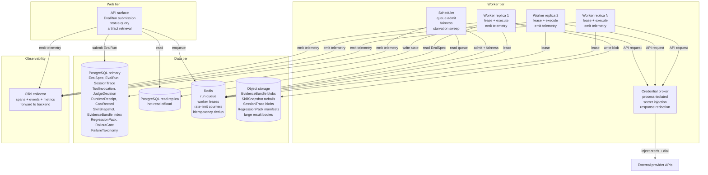
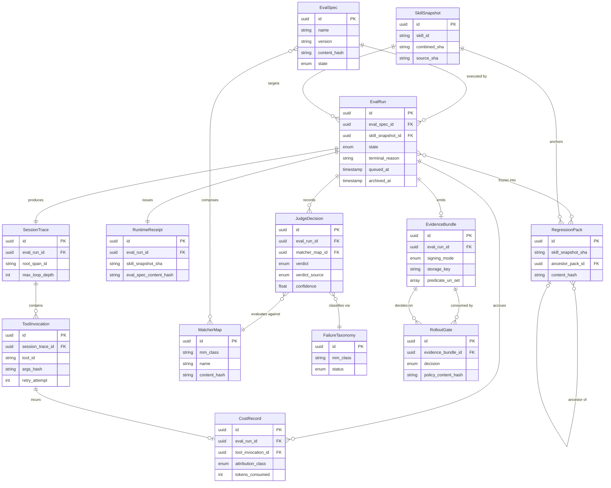
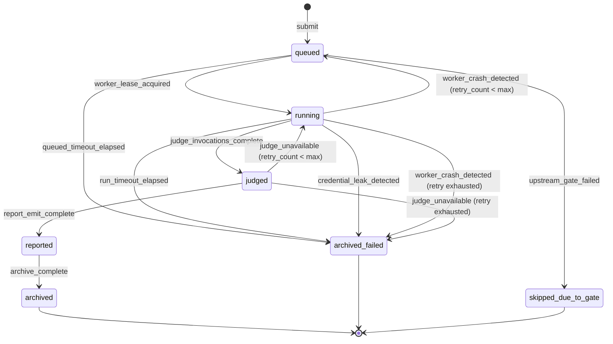
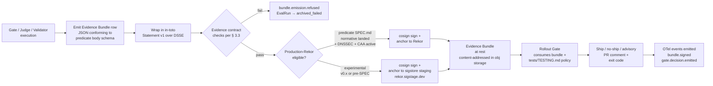

# Platform Runtime Blueprint — Intent Eval Platform

> **This document is the kernel specification.** Blueprint A (`011-AT-ARCH-ecosystem-master-blueprint.md`) is the constitution; Blueprint B is the kernel. Where Blueprint A locks the shape of the ecosystem — mission, principles, anti-goals, governance routing, shared terminology — Blueprint B locks the shape of the runtime: how a single execution flows from queued to archived, which 13 entities the platform manipulates and what their schemas are, how state machines transition, how replay reconstructs evidence, how runtime isolation enforces the credential and execution boundaries, how cost governance enforces the bandwidth and budget ceilings, how observability emits the trace fabric that makes the whole thing legible to an external reviewer, and which deployment philosophy carries all of the above to production.
>
> **What Blueprint B explicitly is NOT.** It is not a per-repo implementation guide — that is Blueprint C, applied per-repo. It is not a glossary — that is `014-DR-GLOS-canonical-glossary.md`. It is not the runtime event taxonomy normative spec — that is `020-AT-ARCH-runtime-event-taxonomy.md` (iel-E12); Blueprint B references the taxonomy and locks the OBSERVABILITY-LAYER decision that the platform IS OpenTelemetry-native, without locking the specific event names. It is not the replay-fidelity levels normative spec — that is `016-AT-STND-replay-fidelity-levels.md` (iel-E11); Blueprint B references RF-0..RF-4 as forward-locks without enumerating them in this document.
>
> **The one spec that IS folded into Blueprint B.** Per the master plan M1 reconciliation (`~/.claude/plans/se-the-council-bubbly-frog.md` § "Reconciliation with the existing M1-M6 journey"), the SPEC.md normative content for the `gate-result/v1` Evidence Bundle predicate is folded into Blueprint B § 7 as the "Evidence Bundle Predicate Contracts" section. This unlocks production-Rekor signing for `intent-rollout-gate` v0.2.0+ per the iar-E08 acceptance gate (DR-010 CISO non-negotiable). The JSON Schema at `intent-eval-lab/specs/evidence-bundle/v0.1.0-draft/schema/gate-result.schema.json` lands as a normative reference alongside this document, not duplicated inside it.
>
> When this document and any downstream document conflict, **this document wins** until the conflict is resolved through a Decision Record per Blueprint A § 2.3 governance routing. The authority chain: this blueprint is bound by DR-010 (Q3 unification thesis + Q5 production-Rekor sequencing), which incorporates DR-004 (Q1 predicate URI namespace + Q5 provider PASS/FAIL gates), which is bound by user directive (acting head of board) per the override addenda in DR-010 § 13.5 and § 13.6. Blueprint A § 7 (authority chain summary) is the canonical reference.

## 0. How to read this document

Blueprint B is organized as seven sections plus four Mermaid diagrams. Section 1 establishes the runtime architecture and the canonical execution lifecycle — the queue, the workers, the storage tiers, the orchestration model. Section 2 is the heaviest section in the entire ecosystem: the 13-entity canonical domain model with ten required attributes per entity, totalling 130 attribute cells that every downstream codegen (Zod for TypeScript, Pydantic for Python) reads as source-of-truth. Section 3 specifies the state machines, the replay semantics, and the evidence contracts that bind the runtime's behaviour to the spec. Section 4 specifies runtime isolation (with the CISO PASS/FAIL gates from DR-004 S1Q5 restated normatively), cost governance, and observability — the three pillars that turn the runtime from a research instrument into something that operates safely on a Saturday afternoon. Section 5 specifies the deployment philosophy (modular monolith) and the forward-compatibility triggers that would justify re-architecting. Section 6 is the four required Mermaid diagrams. Section 7 is the SPEC.md normative fold: the binding contract for the `gate-result/v1` predicate URI.

Readers seeking the **constitution** (mission, principles, anti-goals, governance) should read Blueprint A first. Readers seeking the **per-repo blueprint pattern** should read Blueprint C (template). Readers seeking a **single load-bearing definition** should read the canonical glossary. Readers seeking the kernel specification — what the runtime IS — are in the right document.

---

## 1. Runtime Architecture + Execution Lifecycle

### 1.1 Architecture overview — modular monolith

The Intent Eval Platform runtime is a **modular monolith**. A single deployable unit — one binary or one container image — contains the API surface, the background worker pool, the scheduler, and the lineage tracker. State is partitioned across four canonical backing stores plus one observability collector. There is no service mesh, no internal RPC, no cross-service transaction coordinator, no distributed messaging fabric, no event sourcing, no CQRS, and no Kubernetes-native orchestration.

The four backing stores are:

1. **PostgreSQL** is the system of record for relational state. Every entity in § 2 that the platform persists relationally lives here: EvalSpec rows, EvalRun rows, the run-lineage DAG edges (SessionTrace + ToolInvocation), CostRecord rollups, the FailureTaxonomy registry, the SkillSnapshot index, the JudgeDecision append log, the RolloutGate decision history, and the index of EvidenceBundle row blobs that live in object storage. PostgreSQL is chosen for transactional integrity (every state machine transition in § 3 is durable), mature operational tooling, native JSON column support for predicate bodies that do not justify a dedicated table, partial-index support for hot-cold separation, and the platform's preference for boring database choices.

2. **Redis** is the system of record for ephemeral state. The run queue (per § 1.4 below), the lock-coordination registry (worker leases on EvalRun rows), the rate-limit counters (per-provider, per-user, per-day rollups), the idempotency-key cache (UUIDv7 dedup window), and the transient cache layer for hot read paths all live in Redis. Redis is chosen for its native sorted-set primitives (which the queue depends on), its lease-with-TTL semantics, its single-digit-millisecond latency, and the fact that every ephemeral concern in the system has a clean fallback if Redis is unavailable (the queue can drain into a PostgreSQL outbox table; the lock registry can fall back to a Postgres-row-lock pattern). Redis is a performance store, not a durability store.

3. **Object storage** is the system of record for large immutable artifacts. Replay traces, recorded fixture bundles, complete EvidenceBundle row blobs in their signed in-toto Statement v1 form, the SkillSnapshot tarballs (SHA-pinned source + dependencies + config), the RegressionPack snapshots, and the cold-storage tier for archived SessionTraces all live here. The platform is content-addressed at this layer: every blob is keyed by its sha256 digest. The runtime never overwrites a blob; corrections happen by storing a new blob and updating the PostgreSQL index to reference the new key. Object storage is the durability tier for things that are too large to live in PostgreSQL columns and too immutable to need transactional updates.

4. **Background workers** consume the Redis run queue, execute the EvalRun lifecycle, persist state back to PostgreSQL, and stream blob writes to object storage. Workers are stateless — every piece of state a worker needs is either in its input message, in PostgreSQL, in Redis, or in object storage. A worker that crashes mid-execution causes its EvalRun to transition to a recovery path (per § 3.1) on the next worker lease, not to data corruption.

The one observability collector is **OpenTelemetry**. Every span emitted by any worker, every event emitted by any state-machine transition, every cost-attribution data point, every JudgeDecision, every gate evaluation produces OTel-shaped telemetry. The semantic conventions are locked at iel-E12 (forward-reference; this blueprint locks the OBSERVABILITY-LAYER decision, not the specific event names). The platform's relationship to OpenTelemetry is identical to its relationship to PostgreSQL: a load-bearing dependency on an open standard, treated as boring infrastructure.

**Explicitly deferred — "you have not earned those yet."** This phrase, lifted from the master plan, captures the deployment philosophy bluntly. The following architectural complexity classes are **out of scope** for the modular-monolith runtime and will remain so until a forward-compatibility trigger (per § 5.2) lights a path:

- **Kafka or any message bus beyond Redis.** A persistent commit log is required for systems with multi-team event consumption, replay-via-rewind, or downstream event-sourced services. The platform has none of these properties. Redis + PostgreSQL covers the queue, the lock-coordination, and the durable record.
- **CQRS or event-sourced state.** Command-query responsibility separation is a coordination tool for systems with large independent read teams who need their own optimized projections. The platform has one team and one set of read paths.
- **Kubernetes native orchestration.** Kubernetes is a load-bearing operational complexity for systems with elastic compute requirements and multi-tenant pod isolation. The modular monolith runs comfortably on a small fleet of stateless worker hosts behind a load balancer.
- **Service mesh.** Service mesh is the operational tax of microservices. The platform has no microservices.
- **Distributed transactions.** Two-phase commit, saga orchestration, and outbox-pattern eventual consistency are tools for systems that cannot fit their consistency boundary inside one database transaction. PostgreSQL plus one transactional context per state-machine transition fits every consistency requirement the runtime has.
- **Multi-region replication.** Geographic data residency, low-latency cross-region writes, and active-active failover are tools for systems with global user populations and regulatory data-residency constraints. The platform has neither.

The strategic wedge from Blueprint A § 1.1 ("deterministic evaluation + rollout gates for Claude Code Skills and MCP ecosystems") does not justify any of those complexity classes. The wedge wins on credibility and correctness, not on horizontal-scale theater. When a forward-compatibility trigger lights (§ 5.2), the architecture re-opens for a Class-1 ISEDC review per Blueprint A § 2.3. Until then: modular monolith.

### 1.2 Execution lifecycle — the canonical EvalRun journey

Every EvalRun travels the same state-transition path:

```
queued → running → judged → reported → archived
```

with explicit failure branches at every step (timeout, infrastructure error, judge unavailable, retry-exhausted) and explicit transition events emitted as OpenTelemetry events per the iel-E12 taxonomy. The lifecycle is fully specified in § 3.1; this subsection establishes the canonical names and the runtime's commitment that every EvalRun produces exactly one terminal state.

**Idempotency.** Every EvalRun carries a UUIDv7 (per RFC 9562) generated at queue time. The UUID is the idempotency key. A worker that processes a Run whose UUID is already in the `judged` or later state must skip the duplicate work and emit a `runtime.dedup` OTel event. Idempotency keys live in the Redis dedup cache for at least 24 hours after terminal state; a hard fallback dedup check against PostgreSQL covers the cold path.

**Back-pressure.** When the worker pool is saturated, the queue holds. The API surface returns `202 Accepted` with a queue-depth indicator and an estimated start-time bound. Back-pressure is observable (a `runtime.queue.backpressure` OTel event fires when queue depth exceeds the per-worker concurrency limit times the worker count) and is **not** silently dropped. If a caller submits an EvalRun under back-pressure with a `decline_if_backpressured=true` hint, the API returns `503 Service Unavailable` with a `Retry-After` header.

**Terminal-state guarantee.** Every EvalRun reaches exactly one of: `archived` (the successful terminal state, reached via the canonical path) or `archived_failed` (the unsuccessful terminal state, reached via a failure branch with the failure reason captured). The runtime never leaves a Run indefinitely in a non-terminal state. A Run that has been in `running` for longer than its run-timeout (per § 4.1 below) transitions to `archived_failed` with `reason=run_timeout` regardless of worker liveness, via a sweeper background job.

### 1.3 Orchestration model — composing multi-step runs

A multi-step run — for example, "execute skill A against test corpus X, gate via audit-harness static gates, evaluate via j-rig behavioral judges, decide via rollout-gate against the policy file" — composes into a **lineage DAG**. Each node in the DAG is an EvalRun (or a ToolInvocation under a SessionTrace, per § 2.11), and each edge is a typed dependency declaration:

- **`feeds`** — the upstream node's output is the downstream node's input (e.g., audit-harness output feeds rollout-gate input).
- **`gates`** — the upstream node's pass/fail status is a precondition for the downstream node executing at all (e.g., a failing static gate blocks the behavioral evaluator from running).
- **`enriches`** — the upstream node's output is appended to the downstream node's context but the downstream node executes regardless of upstream status (e.g., cost-attribution rollups enrich the rollout-gate's PR-comment renderer).

The DAG is constructed declaratively from an EvalSpec's `composition` field (per § 2.1). The runtime topologically sorts the DAG, schedules nodes as their upstreams complete, and emits a `runtime.dag.scheduled` event per scheduled node. Cycles are detected at EvalSpec validation time (before any node executes); a cyclic EvalSpec is rejected at submission with a `400 Bad Request`.

Failure propagation in the DAG follows the edge type. A `gates` edge with a failed upstream short-circuits the downstream node to `skipped_due_to_gate`. A `feeds` edge with a failed upstream cascades the downstream node to `archived_failed` with `reason=upstream_feed_failed`. An `enriches` edge with a failed upstream allows the downstream to proceed and records the enrichment-missing state in the downstream's RuntimeReceipt.

### 1.4 Queue model — at-least-once delivery, fairness, starvation prevention

The run queue is a Redis sorted-set, scored by priority + submission timestamp. Workers lease items from the queue using `BZPOPMIN` semantics under a per-worker lease key with TTL. The lease is renewed by the worker every N seconds while the EvalRun is in `running`; if the lease expires (worker crash, node loss, network partition), the EvalRun returns to the queue for a different worker to claim.

**At-least-once delivery.** A worker that successfully completes an EvalRun must record the terminal-state transition in PostgreSQL atomically with releasing the Redis lease. If the lease release succeeds and the PostgreSQL write fails, the next worker will pick up the EvalRun, observe (via idempotency check) that it is already in a terminal state, and skip. If the PostgreSQL write succeeds and the lease release fails, the lease expires naturally and the next worker observes the terminal state and skips. The dedup-by-idempotency-key pattern (§ 1.2) covers both directions of the at-least-once half-failure.

**Idempotency keys** are UUIDv7 per RFC 9562. The time-ordered prefix gives the platform a natural sort order for queue items that arrive in submission-time-near-real-time and a recoverable ordering for cold-storage forensics.

**Worker concurrency limits** are tuned per-worker (a config knob), per-EvalSpec (declared in the spec's `concurrency_hint`), and per-provider (because external API rate-limits dominate cost-per-second). The runtime never exceeds the most-restrictive of the three limits. A worker that observes its per-provider limit is exceeded for an in-flight EvalRun parks the Run back in the queue with a `requeue_after` delay rather than failing.

**Fairness across users** is enforced by a Redis-backed weighted-fair-queueing layer in front of the priority-sorted queue. Each user (or, in the future-tenancy case per iel-E13c, each tenant) gets a share of total worker concurrency proportional to their declared quota. A user submitting 1,000 EvalRuns cannot starve a user submitting 1 EvalRun.

**Starvation prevention.** A Run that has been queued for longer than its `queued_timeout` (per § 4.1) transitions directly to `archived_failed` with `reason=queue_timeout`, regardless of priority. The starvation-prevention sweeper runs at a configurable interval (default 60 seconds) and is observable via `runtime.queue.starvation_swept` OTel events.

---

## 2. Canonical Domain Model — the 13 entities

This section is the heaviest single specification in the Intent Eval Platform. Per the master plan Addendum #3, every entity defines **ten required attributes**: Purpose, Required fields, UUID strategy, Mutability rules, Retention policy, Replayability guarantees, Provenance requirements, Lifecycle states, Storage recommendations, Audit requirements. The 13 entities are the type-source for `intent-eval-core`'s Zod (TypeScript) and Pydantic (Python) codegen per Blueprint A § 4.2 schema-is-canon principle.

The thirteen entities are introduced in dependency order: a downstream entity may reference an upstream entity, but never the reverse. The ERD in § 6.2 visualizes the full relationship graph.

### 2.1 EvalSpec

| Attribute | Specification |
|---|---|
| **Purpose** | Defines the rules of an evaluation: which matchers run, which assertions hold, which expected behaviors are checked, how outputs are scored, and how the run composes into a multi-step DAG. The EvalSpec is the declarative input that drives every EvalRun. It is versioned, content-addressed, and treated as a first-class artifact in its own right — not just configuration. |
| **Required fields** | `id` (UUIDv7), `version` (SemVer), `name` (kebab-case slug), `description` (one paragraph), `matchers` (array of MatcherMap references — § 2.3), `assertions` (array of typed assertion expressions), `scoring` (object specifying aggregation rule — `majority`, `unanimous`, `weighted`), `composition` (DAG declaration per § 1.3), `expected_artifacts` (declared SkillSnapshot SHA(s) this spec targets), `runtime_limits` (token ceiling, wall-clock ceiling, memory ceiling, concurrency hint), `provider_constraints` (allowlist of provider IDs this spec is permitted to invoke), `created_at` (RFC 3339), `created_by` (actor identity), `content_hash` (sha256 of canonical-form serialization). |
| **UUID strategy** | UUIDv7 generated at creation. The UUID never changes across version bumps; the `version` field disambiguates revisions of the same logical spec. Deterministic derivation: a SpecRevision event ID is derived as `sha256(spec_id || version || content_hash)[:16]`. |
| **Mutability rules** | Mutable while in `draft`; immutable once `published`. A revision is a new row with the same `id` and an incremented `version` — never an in-place edit. The `content_hash` field detects accidental mutation: a row whose stored body does not hash to its declared `content_hash` is corrupt and refused at read. |
| **Retention policy** | Indefinite. EvalSpecs are reference data. Hot in PostgreSQL forever; the platform never archives them. The cost of retention is negligible (typical spec is <10 KiB) and the lineage value of permanent retention is high. |
| **Replayability guarantees** | An EvalSpec is the input to replay, not the subject. A re-execution of a Run from a stored EvalSpec at fixed `content_hash` reproduces the same matcher selection, the same assertion set, and the same scoring rule. Replay-fidelity: contributes RF-strict-input (per iel-E11 forward-ref) to the overall RF level of the replayed Run. |
| **Provenance requirements** | Authored by an identified actor (human or system). Signature optional in v0.1; required for `published` specs in v0.2+ once the EvalSpec predicate URI (`evals.intentsolutions.io/eval-spec/v1`, conditional approval per DR-010 Q3) lands SPEC.md normative content. Until then, the `created_by` field plus a cosign keyless signature on the content hash is recommended. |
| **Lifecycle states** | `draft` → `published` → `deprecated`. Transitions: `draft → published` requires a content-hash freeze; `published → deprecated` is reversible (`deprecated → published` is permitted for emergency un-deprecation). A deprecated EvalSpec MAY still be referenced by historical EvalRuns but MUST NOT be the target of new submissions. |
| **Storage recommendations** | PostgreSQL `eval_specs` table for the index + canonical body. Large `expected_artifacts` lists with deep nesting MAY spill to object storage referenced by sha256 key, with the PostgreSQL row carrying the reference. |
| **Audit requirements** | An auditor reading an EvalSpec row in isolation can reconstruct: what was tested, how the test was scored, which SkillSnapshot was the target, which providers were permitted, and what the actor identity of the spec author was. They cannot reconstruct the actual Run outcomes — those live in the EvalRun rows that reference this spec. |

### 2.2 EvalRun

| Attribute | Specification |
|---|---|
| **Purpose** | A single execution instance of an EvalSpec against a specific SkillSnapshot. The EvalRun is the unit of work in the runtime; everything observable about a Run — its inputs, its lineage, its outputs, its judge decisions, its evidence, its cost — hangs off the EvalRun row. |
| **Required fields** | `id` (UUIDv7), `eval_spec_id` (FK to § 2.1), `eval_spec_version`, `eval_spec_content_hash` (frozen at queue time — defends against mid-flight spec mutation), `skill_snapshot_id` (FK to § 2.9), `state` (enum per Lifecycle below), `queued_at`, `started_at` (nullable), `judged_at` (nullable), `reported_at` (nullable), `archived_at` (nullable), `terminal_reason` (nullable enum — see § 3.1), `worker_id` (nullable — identifies the worker that leased this Run), `lease_expires_at` (nullable), `session_trace_id` (FK to § 2.10, populated as the Run executes), `evidence_bundle_id` (FK to § 2.4, populated at `judged → reported` transition), `cost_record_id` (FK to § 2.12, populated continuously), `parent_run_id` (nullable — for runs that are children of a multi-step DAG per § 1.3), `idempotency_key` (UUIDv7, defaults to `id`), `submitted_by` (actor identity). |
| **UUID strategy** | UUIDv7. Time-ordered prefix enables natural-order processing and cold-storage forensics by submission window. The UUIDv7 derivation uses the system clock at queue time; the runtime tolerates ±10 ms clock skew across workers without correctness issues (idempotency dedup catches the rest). |
| **Mutability rules** | Mutable while in non-terminal states (state transitions update the row); frozen at terminal state. After `archived`, no field of an EvalRun row is ever updated again. Append-only references (cost rollups, evidence rows) attach by FK from those entities, not by mutation of the EvalRun row. |
| **Retention policy** | Hot in PostgreSQL for 30 days post-terminal; cold (compressed PostgreSQL partition or object-storage row archive) for 180 days; archive (object storage only, PostgreSQL index row stub remains) thereafter. The full lifecycle is specified in iel-E14b (`018-OD-STND-economics-and-cost-governance.md`, forward-ref). |
| **Replayability guarantees** | An EvalRun is the SUBJECT of replay. Re-executing a Run from its stored evidence + frozen SkillSnapshot SHA + frozen tool versions + frozen environment reproduces the verdict at the RF level declared by the predicate types in the Run's EvidenceBundle. RF-strict reproduces bitwise; RF-best-effort reproduces semantically with documented sources of non-determinism. Replay levels RF-0..RF-4 are enumerated in iel-E11 (forward-ref). |
| **Provenance requirements** | Every EvalRun terminal state emits a RuntimeReceipt (§ 2.6) which is itself signed and attested. The EvalRun row is not directly signed in v0.1; signing lives at the receipt and bundle layer. In v0.2+ (after `eval-run-summary/v1` predicate URI lands SPEC.md normative content, conditional per DR-010 Q3), terminal-state EvalRun summaries MAY be directly attested. |
| **Lifecycle states** | `queued` → `running` → `judged` → `reported` → `archived`. Failure branches per § 3.1. Special states: `skipped_due_to_gate` (terminal — DAG gate upstream failed), `archived_failed` (terminal — failure-branch terminal). |
| **Storage recommendations** | PostgreSQL `eval_runs` table partitioned by `queued_at` month for efficient cold migration. Hot partition stays in primary tablespace; cold partitions migrate to compressed tablespace at 30-day mark; archive transitions index-only at 180-day mark. |
| **Audit requirements** | An auditor reading an EvalRun row in isolation can reconstruct: which spec was executed against which skill, when each lifecycle transition occurred, which worker executed it, what the terminal reason was, and which downstream artifacts (SessionTrace, EvidenceBundle, CostRecord, RuntimeReceipt) the auditor must fetch to complete the picture. The EvalRun row is the **anchor** of the lineage graph for any single execution. |

### 2.3 MatcherMap

| Attribute | Specification |
|---|---|
| **Purpose** | Maps an input shape to an expected-behavior shape. The MM-1..MM-6 Intentional Mapping vocabulary (renamed from "matcher-map" per DR-005) lives here as the canonical failure-mode framework. A MatcherMap declares "for inputs that look like X, the expected behavior is Y" — the EvalSpec composes MatcherMaps into the assertion logic that judges then evaluate. |
| **Required fields** | `id` (UUIDv7), `mm_class` (enum: `MM-1`, `MM-2`, `MM-3`, `MM-4`, `MM-5`, `MM-6`; per FUTURE — `MM-7+` via CONTRIBUTING-failure-shape path per DR-004 S1Q3 + DR-010 reaffirmation), `name` (kebab-case slug), `input_pattern` (typed pattern declaration — regex, JSON Schema fragment, or structural matcher), `expected_behavior` (typed behavior declaration — exact match, semantic match, contract-conformance, redaction-confirmed, etc.), `version` (SemVer), `content_hash` (sha256 of canonical-form serialization), `description`, `created_at`, `created_by`. |
| **UUID strategy** | UUIDv7. The MatcherMap's `mm_class` field is a categorical attribute, not a UUID — multiple MatcherMap rows may share the same `mm_class` (e.g., many different MM-3 cooldown matchers). |
| **Mutability rules** | Immutable once published. A revision is a new row with the same `name` and an incremented `version`. The `content_hash` defends against tamper. |
| **Retention policy** | Indefinite, like EvalSpec. MatcherMaps are reference data with negligible storage cost and high lineage value. |
| **Replayability guarantees** | A MatcherMap is the input to a JudgeDecision's matching logic. Re-execution of a JudgeDecision against the same input + same MatcherMap content_hash + same judge version reproduces the same matching outcome (deterministic at the matching layer; the judge's verdict may be probabilistic at the LLM layer for LLM-judges, in which case the judge's `verdict_source = llm_with_seed` declares the non-determinism source). |
| **Provenance requirements** | Authored by an identified actor. v0.2+ predicate URI `evals.intentsolutions.io/matcher-map/v1` (conditional per DR-010 Q3) enables direct signed attestation of MatcherMap content. Until then, content_hash + cosign keyless signature on the hash is recommended for any MatcherMap referenced by a published EvalSpec. |
| **Lifecycle states** | `draft` → `published` → `deprecated`. Same transition discipline as EvalSpec. |
| **Storage recommendations** | PostgreSQL `matcher_maps` table. Pattern bodies that are large (JSON Schema fragments with deep nesting) MAY spill to object storage referenced by sha256. |
| **Audit requirements** | An auditor reading a MatcherMap row can reconstruct: which MM class the matcher belongs to, what input shape it recognizes, what expected behavior it asserts, who authored it, and when. The actual matching outcomes against specific inputs live in JudgeDecision rows that reference the MatcherMap. |

### 2.4 EvidenceBundle

| Attribute | Specification |
|---|---|
| **Purpose** | Immutable artifact attesting to the outcomes of an EvalRun (or a logical subset of one). An EvidenceBundle is a collection of in-toto Statement v1 rows wrapped in DSSE envelopes for signing per DR-010 Q3 unification thesis. The bundle is the platform's **lingua franca** — every validator, gate, judge, and runtime emits Evidence Bundle rows as architectural primitive (Blueprint A § 1.2 principle 10, schema-is-canon). The full normative specification of the `gate-result/v1` predicate body lives in § 7 of this blueprint. |
| **Required fields** | `id` (UUIDv7), `eval_run_id` (FK to § 2.2), `created_at`, `predicate_uri_set` (array of predicate URIs represented in this bundle's rows), `row_count`, `subject_set` (deduplicated array of in-toto Subject entries across all rows), `storage_key` (sha256-content-addressed object-storage key holding the bundle blob), `signing_mode` (enum: `sigstore_staging`, `rekor_production`, `unsigned_experimental`), `rekor_log_indices` (array of integers; populated for `rekor_production`), `verification_status` (enum: `verified`, `unverified`, `failed`), `verification_last_checked_at`. |
| **UUID strategy** | UUIDv7 for the bundle as a whole. Each row inside the bundle has its own predicate-internal identity via the predicate body (e.g., `gate_id` for `gate-result/v1`); rows do not require their own platform-level UUID because the in-toto Statement subject + predicate URI already uniquely identifies the row within the bundle. |
| **Mutability rules** | **Append-only.** Once a row is added to a bundle and the bundle is signed, the bundle blob is immutable. Corrections happen by emitting a NEW bundle (with a new UUIDv7) that references the prior bundle's content_hash and includes a correcting row. Per Blueprint A § 1.2 principle 3, **evidence is never amended in place**. |
| **Retention policy** | Indefinite for the bundle BLOB. Production-signed bundles anchor to Rekor (which is itself indefinite-retention per sigstore policy). Experimental (sigstore-staging) bundles anchor to `rekor.sigstage.dev`, which is also indefinite-as-far-as-staging-policy-is-concerned. The PostgreSQL index row referencing the bundle is retained indefinitely; the bundle blob in object storage migrates from hot to cold storage class at 90 days and to archive class at 1 year, but is never deleted. |
| **Replayability guarantees** | An EvidenceBundle is the OUTPUT of replay verification, not the subject. A replay of an EvalRun reconstructs the bundle's expected contents and compares hash-for-hash; mismatch = replay-failed verdict. The bundle itself is content-addressed (sha256 storage key), so any drift between stored and reconstructed is detectable. |
| **Provenance requirements** | **MANDATORY** — every row is wrapped in DSSE and signed via cosign. Production-Rekor signing is gated per-predicate on the predicate's SPEC.md normative section landing (DR-010 Q5 CISO non-negotiable). For `gate-result/v1`, the normative section lives in § 7 of this blueprint — production-Rekor signing is unlocked once this blueprint merges. Other predicates (validation-result/v1, eval-verdict/v1, cost-attribution/v1) remain `sigstore_staging` mode until their respective SPEC.md normative sections land. |
| **Lifecycle states** | `building` (rows being appended) → `signing` (DSSE wrap + cosign sign in progress) → `signed` (terminal — bundle is now immutable) → optionally `archived_to_rekor` (sub-state of `signed`, indicates Rekor log indices populated). |
| **Storage recommendations** | PostgreSQL `evidence_bundles` table for the index (id, eval_run_id, storage_key, signing_mode, rekor_log_indices, verification_status, timestamps). Bundle BLOB in object storage, content-addressed by sha256. Verification cache (verification_status + last_checked_at) in PostgreSQL with periodic re-verification background job. |
| **Audit requirements** | An auditor reading an EvidenceBundle row can fetch the bundle blob, verify each row's DSSE signature against the declared signing identity (cosign keyless OIDC subject + issuer, OR cosign keyref), confirm Rekor anchoring for production bundles via `cosign verify-attestation --rekor-url`, and reconstruct every predicate body for every row. **No trust in Intent Solutions is required.** This is the platform's load-bearing audit guarantee. |

### 2.5 JudgeDecision

| Attribute | Specification |
|---|---|
| **Purpose** | Captures a single judge's verdict on a single matching event during an EvalRun. A judge is either a deterministic validator (e.g., an audit-harness static gate that returns PASS or FAIL by mechanical evaluation of an input) or an LLM-as-judge (probabilistic verdict with confidence). The JudgeDecision row preserves the verdict, the input the judge saw, the judge's identity and version, the confidence (if applicable), and any free-form reasoning emitted by the judge. |
| **Required fields** | `id` (UUIDv7), `eval_run_id` (FK), `session_trace_id` (FK), `matcher_map_id` (FK to § 2.3 — the matcher whose expected behavior was being evaluated), `judge_identity` (string — e.g., `audit-harness@0.3.0:escape-scan` or `claude-sonnet-4-5-llm-judge`), `judge_version`, `verdict` (enum: `PASS`, `FAIL`, `ADVISORY`, `NOT_APPLICABLE`, `ERROR`), `verdict_source` (enum: `deterministic`, `llm_with_seed`, `llm_no_seed`, `hybrid`), `confidence` (nullable float 0..1 — populated for LLM judges), `reasoning` (nullable string — free-form judge output), `input_hash` (sha256 of input the judge saw), `seed` (nullable — populated for `llm_with_seed`), `evaluated_at`, `latency_ms`, `cost_record_ref` (FK to § 2.12). |
| **UUID strategy** | UUIDv7. The time-ordered prefix lets the SessionTrace reconstruction (§ 2.10) order judge decisions chronologically without a separate timestamp index. |
| **Mutability rules** | **Immutable at creation.** A JudgeDecision is a point-in-time record. If a judge produces a follow-up verdict (e.g., LLM-judge with a second opinion), it is a new JudgeDecision row, not a mutation. |
| **Retention policy** | Hot in PostgreSQL for the duration of the parent EvalRun's hot tier (30 days). Cold archive alongside the parent EvalRun's cold migration. JudgeDecision rows are critical replay inputs and never deleted. |
| **Replayability guarantees** | A deterministic JudgeDecision is exactly replayable (RF-strict): re-running the same judge against the same input hash produces the same verdict. An `llm_with_seed` JudgeDecision is replayable to RF-best-effort: re-running with the same seed and the same model snapshot produces the same verdict modulo provider-side non-determinism (documented as a known source). An `llm_no_seed` JudgeDecision is NOT replayable beyond statistical reconstruction; the platform discourages this `verdict_source` and surfaces it as a replay-fidelity warning in dashboards. |
| **Provenance requirements** | Every JudgeDecision is included as an in-toto Statement v1 row in the parent EvalRun's EvidenceBundle under the `eval-verdict/v1` predicate URI (conditional approval per DR-010 Q3 — currently `sigstore_staging` until that predicate's SPEC.md normative section lands). DSSE wrap + cosign signature applies. |
| **Lifecycle states** | `recorded` (terminal — JudgeDecisions are single-state entities). |
| **Storage recommendations** | PostgreSQL `judge_decisions` table partitioned by `evaluated_at` month, FK-indexed by `eval_run_id` and `session_trace_id`. Large reasoning bodies (>4 KiB) spill to object storage referenced by sha256. |
| **Audit requirements** | An auditor reading a JudgeDecision row can reconstruct: which judge produced the verdict, what input the judge saw (via `input_hash` + fetch from input store), what the verdict was, what the confidence was if probabilistic, and what reasoning the judge emitted. Combined with the parent SessionTrace and EvidenceBundle, the auditor reconstructs the entire decision context. |

### 2.6 RuntimeReceipt

| Attribute | Specification |
|---|---|
| **Purpose** | Execution proof. The RuntimeReceipt is the platform's "what actually ran" record: which EvalSpec version, which SkillSnapshot SHA, which provider versions and adapters, which tool versions for every ToolInvocation, which environmental constraints were in effect (timeout, token ceiling, memory ceiling), and what the actual resource usage was. Receipts are emitted at every EvalRun terminal-state transition and are themselves signed and attested. |
| **Required fields** | `id` (UUIDv7), `eval_run_id` (FK), `created_at`, `eval_spec_content_hash`, `skill_snapshot_sha`, `provider_adapter_versions` (object: `{provider_id: version_string}`), `tool_versions` (object: `{tool_id: version_string}`), `runtime_limits_in_effect` (object: copy of EvalSpec's runtime_limits at queue time), `actual_resource_usage` (object: `{tokens_consumed, wall_clock_ms, peak_memory_mb, network_egress_bytes}`), `worker_identity` (string), `worker_host_fingerprint` (sha256 — defends against worker-host tamper), `terminal_state`, `terminal_reason`, `evidence_bundle_id` (FK), `cost_record_id` (FK). |
| **UUID strategy** | UUIDv7. One receipt per EvalRun terminal-state transition; cardinality is exactly equal to count of EvalRuns. |
| **Mutability rules** | **Immutable at creation.** Receipts are signed before they are persisted; mutation invalidates the signature. |
| **Retention policy** | Hot in PostgreSQL for 90 days, cold for 1 year, archive thereafter. The full lifecycle is specified in iel-E14b. |
| **Replayability guarantees** | A RuntimeReceipt is the INPUT to replay verification. Re-executing an EvalRun against the receipt's frozen versions reproduces (to RF level) the original verdict; the receipt is what makes "frozen versions" specifiable in the first place. |
| **Provenance requirements** | **MANDATORY** — every receipt is included as an in-toto Statement v1 row in the parent EvalRun's EvidenceBundle under the `runtime-receipt/v1` predicate URI (conditional approval per DR-010 Q3 — currently `sigstore_staging` until SPEC.md normative section lands). DSSE wrap + cosign signature. |
| **Lifecycle states** | `issued` (terminal — receipts are single-state). |
| **Storage recommendations** | PostgreSQL `runtime_receipts` table partitioned alongside `eval_runs`. Receipt body included as JSONB column for efficient access. |
| **Audit requirements** | An auditor reading a RuntimeReceipt can reconstruct, in isolation, the complete execution context: spec version, skill version, every tool and provider version, runtime limits, actual usage, and the worker that did the work. The receipt is the **integrity anchor** for the EvalRun's execution claims. |

### 2.7 RegressionPack

| Attribute | Specification |
|---|---|
| **Purpose** | Frozen historical benchmark. A RegressionPack captures a specific set of EvalRun outcomes against a specific SkillSnapshot at a specific moment for a specific reason. Once committed, the pack is **immutable**. New regression evidence becomes a new pack referencing its ancestor. This is what makes one-variable-change discipline (Blueprint A § 1.2 principle 6) detectable: comparing pack N vs pack N+1 reveals exactly which variable changed and what outcomes shifted. |
| **Required fields** | `id` (UUIDv7), `name` (human-readable slug), `purpose` (one-paragraph description), `skill_snapshot_sha`, `eval_spec_ids` (array of EvalSpecs included), `eval_run_ids` (array of EvalRuns frozen into the pack), `outcome_summary` (object: aggregate pass/fail rates per matcher class), `ancestor_pack_id` (nullable FK — the prior pack this one supersedes), `delta_declaration` (free-form description of what variable changed vs ancestor), `created_at`, `created_by`, `content_hash` (sha256 of canonical-form serialization). |
| **UUID strategy** | UUIDv7. Time-ordered prefix gives natural chronological ordering of packs in the lineage chain. |
| **Mutability rules** | **Immutable once committed.** A pack in `draft` state may be modified; once transitioned to `committed`, no field is ever updated again. Corrections happen by committing a new pack with `ancestor_pack_id` pointing at the prior pack. |
| **Retention policy** | Indefinite. Regression packs are reference benchmarks with high lineage value and modest storage cost. Stored hot in PostgreSQL index + object-storage blob (for the full eval_run_ids manifest and outcome summary). |
| **Replayability guarantees** | A RegressionPack is fully replayable: re-executing every EvalRun in the pack against the same SkillSnapshot SHA + same EvalSpec content_hashes reproduces the outcome summary to RF level. Drift between original and replay outcome surfaces as a regression-pack-drift OTel event. |
| **Provenance requirements** | Authored by an identified actor. Content_hash + cosign keyless signature on the hash is mandatory at commit. v0.2+ predicate URI `evals.intentsolutions.io/regression-pack/v1` (conditional per DR-010 Q3) for direct attestation. |
| **Lifecycle states** | `draft` → `committed` → `superseded` (when a descendant pack is committed). |
| **Storage recommendations** | PostgreSQL `regression_packs` table for the index; pack body (full EvalRun manifest + outcome summary) in object storage, content-addressed. |
| **Audit requirements** | An auditor reading a RegressionPack can reconstruct the ancestry chain (via `ancestor_pack_id` traversal), the delta declared at each step, the SkillSnapshot SHA at each pack, and the aggregate outcome shift between packs. This is the platform's primary surface for detecting regressions in skill quality across versions. |

### 2.8 RolloutGate

| Attribute | Specification |
|---|---|
| **Purpose** | Promotion decision engine. The RolloutGate consumes an EvidenceBundle + a `tests/TESTING.md`-shaped policy and emits a ship / no-ship / advisory verdict. The RolloutGate is the platform's user-facing surface — the thing engineers actually run as a CI gate. The decision LOGIC lives in `@j-rig/rollout-gate` (per Blueprint A § 2.1); the GitHub Action SHELL lives in `intent-rollout-gate`. |
| **Required fields** | `id` (UUIDv7), `eval_run_id` (FK — the run whose bundle the gate consumed), `evidence_bundle_id` (FK), `policy_ref` (string — content_hash + path to the `tests/TESTING.md` policy evaluated), `policy_content_hash` (sha256 — defends against mid-flight policy mutation), `decision` (enum: `ship`, `no_ship`, `advisory`, `error`), `decision_reasons` (array of structured strings — one reason per matched-or-unmatched policy rule), `coverage` (object: which predicates were covered by the bundle vs which the policy expected), `evaluated_at`, `gate_version` (string — version of the gate logic), `signing_mode` (enum matching § 2.4), `rekor_log_index` (nullable integer). |
| **UUID strategy** | UUIDv7. One gate decision per `(eval_run_id, policy_ref)` pair; the (eval_run_id, policy_ref) tuple is the natural uniqueness constraint, with the UUID serving as the platform-level identity. |
| **Mutability rules** | **Immutable at creation.** A new policy evaluation against the same bundle is a NEW RolloutGate row, not a mutation. This is what enables policy-evolution analysis: "what would yesterday's bundle have decided under today's policy?" |
| **Retention policy** | Hot in PostgreSQL for 90 days (mirrors RuntimeReceipt), cold for 1 year, archive thereafter. |
| **Replayability guarantees** | Fully replayable: a re-execution of the gate logic against the same bundle + same policy content_hash + same gate_version produces the same decision. Drift surfaces as a `gate.decision.drift` OTel event. |
| **Provenance requirements** | Every RolloutGate decision is emitted as an in-toto Statement v1 row under the `gate-result/v1` predicate URI per § 7 below. This is the FIRST predicate URI with SPEC.md normative content landing — production-Rekor signing is unlocked for `gate-result/v1` as soon as this blueprint merges. |
| **Lifecycle states** | `evaluated` (terminal — gate decisions are single-state). |
| **Storage recommendations** | PostgreSQL `rollout_gate_decisions` table FK-indexed by eval_run_id. Decision body (reasons + coverage) as JSONB column. |
| **Audit requirements** | An auditor reading a RolloutGate decision row + the referenced EvidenceBundle + the referenced policy file can fully reconstruct the decision: which predicates were attested, which policy rules matched, which were unmet, what the coverage was, and why the decision landed where it did. This is the surface engineers and reviewers interact with most directly. |

### 2.9 SkillSnapshot

| Attribute | Specification |
|---|---|
| **Purpose** | Immutable skill version. A SkillSnapshot is the SHA-pinned freeze of a skill's source code, declared dependencies, and configuration at a specific moment. Production references to a skill go through a SkillSnapshot — never to mutable `main`. Rollback is "switch the pin back" (Blueprint A § 1.2 principle 4); rolling forward through a passing RolloutGate produces a new SkillSnapshot, never an in-place edit. |
| **Required fields** | `id` (UUIDv7), `skill_id` (logical skill identifier — e.g., a kebab-case slug `validate-skillmd`), `source_sha` (sha256 of the source tarball), `dependency_lock_sha` (sha256 of the dependency lock file or equivalent), `config_sha` (sha256 of the skill's configuration), `combined_sha` (sha256 of `source_sha || dependency_lock_sha || config_sha` — the canonical pin), `version_label` (optional SemVer if the upstream skill declares one), `storage_key` (object-storage key of the snapshot tarball), `created_at`, `created_by`. |
| **UUID strategy** | UUIDv7 for the platform-level identity. The load-bearing identifier in practice is `combined_sha`; the UUID is for indexing and FK convenience. |
| **Mutability rules** | **Immutable.** A SkillSnapshot is never modified after creation. A new snapshot for the same logical skill is a new row with a new UUID and a new `combined_sha`. |
| **Retention policy** | Indefinite for snapshots referenced by any RegressionPack, EvalRun, or production SkillSnapshot pin. Orphan snapshots (no incoming references) MAY be garbage-collected after a 1-year orphan window; in practice the storage cost is low enough that the platform defaults to no GC. |
| **Replayability guarantees** | A SkillSnapshot is the IDENTITY ANCHOR for replay. Two EvalRuns that reference the same `combined_sha` are guaranteed to be evaluating identical skill content. This is the foundation of one-variable-change discipline: change exactly one of `source_sha`, `dependency_lock_sha`, or `config_sha` to isolate which variable shifted outcomes. |
| **Provenance requirements** | Optional in v0.1; recommended via cosign keyless signature on the `combined_sha`. v0.2+ predicate URI `evals.intentsolutions.io/skill-snapshot/v1` (deferred per Phase B+) for direct attestation. |
| **Lifecycle states** | `created` (terminal — snapshots are single-state). |
| **Storage recommendations** | PostgreSQL `skill_snapshots` table for the index; snapshot tarball in object storage, content-addressed by `combined_sha`. |
| **Audit requirements** | An auditor reading a SkillSnapshot row can fetch the tarball, verify the `combined_sha`, inspect the exact source and dependencies, and confirm the actor identity of the snapshot creator. This is the platform's "what code was evaluated" anchor. |

### 2.10 SessionTrace

| Attribute | Specification |
|---|---|
| **Purpose** | Execution lineage. A SessionTrace is the DAG of ToolInvocations, retries, JudgeDecisions, and gate evaluations that occurred during the lifetime of a single EvalRun. The trace is the platform's surface for replay visualization, disagreement analysis, loop-depth monitoring, and forensic reconstruction. |
| **Required fields** | `id` (UUIDv7), `eval_run_id` (FK), `created_at`, `closed_at` (nullable — populated at terminal-state), `root_span_id` (OTel-compatible span id), `total_spans`, `max_loop_depth`, `total_tool_invocations`, `total_judge_decisions`, `trace_blob_storage_key` (object-storage key holding the full DAG serialization). |
| **UUID strategy** | UUIDv7. One SessionTrace per EvalRun (1:1 cardinality). |
| **Mutability rules** | Mutable while the parent EvalRun is in non-terminal state (spans append as execution progresses); frozen at parent terminal-state. After freeze, the `trace_blob_storage_key` references an immutable blob. |
| **Retention policy** | Hot in PostgreSQL (index row) + object storage (trace blob) for 30 days. Cold (compressed in object storage) for 180 days. Archive thereafter. The full lifecycle in iel-E14b. |
| **Replayability guarantees** | A SessionTrace is the OUTPUT of replay. Re-executing an EvalRun reconstructs the trace; diff against the original trace surfaces any deviation. The trace is rendered side-by-side in dashboards for replay-comparison workflows. |
| **Provenance requirements** | The trace itself is not directly signed (it is reconstructible from its constituent spans, which OTel emits in real-time to a collector). The IMMUTABILITY guarantee at freeze is structural: the trace blob is content-addressed, so any post-freeze mutation is detectable as a hash mismatch. |
| **Lifecycle states** | `open` (parent EvalRun in non-terminal state) → `closed` (parent reached terminal state — trace blob written and content_hash recorded). |
| **Storage recommendations** | PostgreSQL `session_traces` table for the index. Trace blob (DAG serialization with all spans, edges, retries, decisions) in object storage. |
| **Audit requirements** | An auditor reading a SessionTrace can fetch the blob, render the DAG, follow the lineage from root span to every leaf, identify every retry attempt, every judge decision, every gate evaluation, and the timing of each. This is the primary surface for understanding "what happened during this run." |

### 2.11 ToolInvocation

| Attribute | Specification |
|---|---|
| **Purpose** | Tool-level execution record. Every time the runtime invokes a tool — an audit-harness subcommand, a j-rig judge, a provider API call, an internal validator — a ToolInvocation row records the invocation. Tool invocations are the leaves of the SessionTrace DAG. |
| **Required fields** | `id` (UUIDv7), `session_trace_id` (FK), `parent_span_id` (OTel span id — locates the invocation in the DAG), `tool_id` (string — e.g., `audit-harness:escape-scan`, `j-rig:tier3-llm-judge`, `provider:anthropic:claude-sonnet-4-5`), `tool_version`, `args` (JSONB — sanitized; credentials redacted), `args_hash` (sha256 of canonical-form args), `result_summary` (JSONB — sanitized), `result_hash` (sha256 of canonical-form result body), `result_storage_key` (nullable — object-storage key for large result bodies), `invoked_at`, `latency_ms`, `cost_record_ref` (FK), `error` (nullable enum + message), `retry_attempt` (integer, 0-indexed). |
| **UUID strategy** | UUIDv7. Time-ordered prefix supports chronological reconstruction within a SessionTrace. |
| **Mutability rules** | **Immutable at creation.** Retries are NEW ToolInvocation rows with incremented `retry_attempt`, not mutations. |
| **Retention policy** | Hot for 30 days (alongside parent EvalRun), cold for 180 days, archive thereafter. Result bodies (`result_storage_key` blobs) MAY be migrated to cheaper storage classes more aggressively if `size > 1 MiB`. |
| **Replayability guarantees** | Fully replayable for deterministic tools: re-invoking with the same `args_hash` produces the same `result_hash`. Non-deterministic tools (LLM providers without seed control) have RF-best-effort: documented as such in the tool's adapter declaration. |
| **Provenance requirements** | Not individually signed; aggregated under the SessionTrace + EvidenceBundle for the parent EvalRun. Credential redaction (per § 4.1 PASS/FAIL gate) is enforced before persistence — a ToolInvocation row that contains a credential-shaped string in `args` or `result_summary` causes the runtime to reject the persistence and fail the parent EvalRun with `reason=credential_leak_detected`. |
| **Lifecycle states** | `invoked` (terminal — invocations are single-state; retries are separate rows). |
| **Storage recommendations** | PostgreSQL `tool_invocations` table partitioned by `invoked_at` month. Large result bodies (`>4 KiB`) spill to object storage. |
| **Audit requirements** | An auditor reading a ToolInvocation can reconstruct: which tool was invoked, with which args, what the result was, how long it took, how many retries preceded it, and what cost it incurred. The auditor's ability to verify "no credential leaked" depends on the redaction discipline being honored upstream — which is why credential redaction is a CISO PASS/FAIL gate per § 4.1. |

### 2.12 CostRecord

| Attribute | Specification |
|---|---|
| **Purpose** | Cost attribution. A CostRecord captures the cost of a unit of work along several attribution dimensions: per EvalRun, per provider, per judge, per replay, per cache decision, per user, per day. Cost records are the input to budget enforcement (per § 4.2), to per-feature cost analysis, and to the optimizer's bandwidth-vs-quality tradeoff surfaces (forward-ref iel-E14b). |
| **Required fields** | `id` (UUIDv7), `eval_run_id` (FK, nullable for system-level cost records), `tool_invocation_id` (FK, nullable for run-level rollups), `attribution_class` (enum: `run`, `provider`, `judge`, `replay`, `cache_decision`, `optimizer_experiment`, `system`), `provider_id` (nullable string), `tokens_consumed` (integer), `prompt_tokens` (integer), `completion_tokens` (integer), `cached_tokens` (integer — populated for cache hits), `wall_clock_ms`, `external_api_cost_micro_usd` (integer in micro-USD for precision), `recorded_at`, `cost_basis_version` (string — version of the cost-basis lookup table used). |
| **UUID strategy** | UUIDv7. High cardinality (one per ToolInvocation plus rollups per EvalRun plus daily rollups per user); the time-ordered prefix supports time-range queries. |
| **Mutability rules** | **Immutable at creation.** Rollups are separate rows, not mutations of leaf rows. |
| **Retention policy** | Hot for 90 days (for live budget enforcement), cold for 2 years (for cost analytics), archive thereafter. Aggregated rollups (per-day, per-user, per-provider) retained longer than leaf rows. |
| **Replayability guarantees** | Cost records are NOT replay-deterministic — re-execution may consume different cost depending on cache state, provider pricing changes, and seed-vs-no-seed routing. Cost records carry `cost_basis_version` so a replay can declare the original cost basis vs the replay-time basis. |
| **Provenance requirements** | v0.2+ predicate URI `evals.intentsolutions.io/cost-attribution/v1` (conditional approval per DR-010 Q3; CISO bound it as "approve with reservations — tamper-evidence over confidentiality"). Currently `sigstore_staging` mode until SPEC.md normative section lands. |
| **Lifecycle states** | `recorded` (terminal). |
| **Storage recommendations** | PostgreSQL `cost_records` table partitioned by `recorded_at` month. Aggregated rollups in separate materialized views refreshed on a schedule. |
| **Audit requirements** | An auditor reading CostRecord rows + the cost_basis_version table can reconstruct: total tokens consumed for a run, total external-API spend, breakdown by provider, breakdown by judge, breakdown by cache decision (hit vs miss). This is the surface for per-feature cost analysis and budget enforcement. |

### 2.13 FailureTaxonomy

| Attribute | Specification |
|---|---|
| **Purpose** | Canonical failure shapes. The FailureTaxonomy registry holds the MM-1..MM-6 Intentional Mapping vocabulary as the v1 enumeration, with the explicit extension path documented in `intent-eval-lab/specs/CONTRIBUTING-failure-shape.md` per DR-004 S1Q3 (MM-7+ via community contribution path; DR-010 reaffirmation). The FailureTaxonomy is **reference data** — every JudgeDecision's `verdict=FAIL` MUST classify against an entry in this registry. |
| **Required fields** | `id` (UUIDv7), `mm_class` (string — `MM-1`, `MM-2`, ..., `MM-N`), `name` (kebab-case slug), `description` (paragraph), `discriminating_question` (string — the question a human asks to decide whether a given failure belongs to this class), `examples` (array of structured example references), `version` (SemVer), `status` (enum: `canonical`, `proposed`, `deprecated`), `created_at`, `created_by`. |
| **UUID strategy** | UUIDv7 for the row identity. The `mm_class` field is the natural key in practice. |
| **Mutability rules** | Mutable for `proposed` entries (community contributions per CONTRIBUTING-failure-shape); immutable once promoted to `canonical`. A canonical entry transitions to `deprecated` only via a Class-1 ISEDC Decision Record (Blueprint A § 2.3). |
| **Retention policy** | Indefinite. Reference data. |
| **Replayability guarantees** | N/A — the FailureTaxonomy is not replay-subject. Its role is classification reference. |
| **Provenance requirements** | N/A for the registry itself. Individual JudgeDecisions reference a FailureTaxonomy `mm_class` and inherit provenance via the JudgeDecision's own attestation. |
| **Lifecycle states** | `proposed` → `canonical` → `deprecated`. |
| **Storage recommendations** | PostgreSQL `failure_taxonomy` table. Small (typically <100 rows total across all versions); always hot. |
| **Audit requirements** | An auditor reading the FailureTaxonomy can enumerate every recognized failure class, read the discriminating question for each, and verify that every `FAIL` JudgeDecision in the system classifies against a current `canonical` or `proposed` entry. Drift (a JudgeDecision referencing an `mm_class` that does not exist in the registry) is a system-integrity violation surfaced via the `taxonomy.drift.detected` OTel event. |

### 2.14 Entity-relationship overview

The 13 entities form a directed acyclic reference graph rooted at EvalSpec (the input) and EvalRun (the unit of work), branching into evidence (EvidenceBundle, JudgeDecision, RuntimeReceipt), lineage (SessionTrace, ToolInvocation), cost (CostRecord), and reference data (MatcherMap, SkillSnapshot, RegressionPack, RolloutGate, FailureTaxonomy). The full ERD is rendered as Mermaid in § 6.2.

The dependency direction is rigid: a reference-data entity (EvalSpec, MatcherMap, SkillSnapshot, FailureTaxonomy) never depends on a runtime entity. A runtime entity (EvalRun, SessionTrace, ToolInvocation, JudgeDecision, RuntimeReceipt, EvidenceBundle, CostRecord) may depend on any reference-data entity but may not depend on a higher-level runtime entity (e.g., ToolInvocation depends on SessionTrace, not the reverse). The RolloutGate and RegressionPack are derived entities that depend on runtime entities (EvidenceBundle for RolloutGate; EvalRun for RegressionPack).

This rigid direction is what makes the schema codegen deterministic (no cycles) and what makes lineage reconstruction tractable (always traverse from the EvalRun root outward).

---

## 3. State Machines + Replay Semantics + Evidence Contracts

### 3.1 Runtime state machines

The runtime enforces formal state machines on EvalRun, retry policy, rollback policy, and promotion policy. State transitions are defined as `(from_state, event, to_state)` triples with explicit guards. The Mermaid diagram in § 6.3 renders the EvalRun machine; the other three are described below.

**EvalRun state machine.**

| from_state | event | to_state | guard |
|---|---|---|---|
| `queued` | `worker_lease_acquired` | `running` | worker concurrency limit not exceeded; per-provider limit not exceeded; per-user fairness budget available |
| `queued` | `queued_timeout_elapsed` | `archived_failed` | `now - queued_at > queued_timeout` |
| `queued` | `upstream_gate_failed` | `skipped_due_to_gate` | parent DAG node terminal_reason in gate-failure set |
| `running` | `judge_invocations_complete` | `judged` | all required JudgeDecision rows recorded |
| `running` | `run_timeout_elapsed` | `archived_failed` | `now - started_at > run_timeout` |
| `running` | `worker_crash_detected` | `queued` | lease expired; retry_count < max_retries |
| `running` | `worker_crash_detected` | `archived_failed` | retry_count >= max_retries; reason=worker_crash_exhausted |
| `running` | `credential_leak_detected` | `archived_failed` | a ToolInvocation persistence attempt contained credential-shaped string; reason=credential_leak_detected |
| `judged` | `report_emit_complete` | `reported` | EvidenceBundle finalized and signed; RuntimeReceipt issued |
| `judged` | `judge_unavailable` | `running` | retryable judge failure; retry_count < max_retries |
| `judged` | `judge_unavailable` | `archived_failed` | retry exhausted; reason=judge_unavailable_exhausted |
| `reported` | `archive_complete` | `archived` | cold-storage migration confirmed |

The set of valid terminal states is `{archived, archived_failed, skipped_due_to_gate}`. The runtime guarantees every EvalRun reaches exactly one terminal state.

**Retry state machine.** Exponential backoff with jitter. `initial_delay_ms = 1000`; `backoff_factor = 2.0`; `max_delay_ms = 60000`; `max_retries = 5` (per-EvalSpec override permitted up to a hard cap of 20). After `max_retries`, the EvalRun transitions to `archived_failed` with `reason` set to the underlying failure cause. Dead-letter classification: a Run with `reason in {credential_leak_detected, run_timeout_elapsed, queued_timeout_elapsed}` is NEVER retried; those reasons indicate structural failure, not transient.

**Rollback state machine.** A rollback is a Class-1 governance event (Blueprint A § 2.3). The rollback lifecycle: `initiated_by` (actor identity) → `rollback_target_version` (SkillSnapshot SHA or RegressionPack ancestor) → `rollback_status` (`pending`, `executing`, `completed`, `failed`) → `post_rollback_verification` (a verification EvalRun that confirms the target version produces expected outcomes). A failed `post_rollback_verification` surfaces as a CRITICAL OTel event and pages the on-call surface.

**Promotion state machine.** Promotion lifecycle: `candidate` (a new SkillSnapshot exists; no production reference yet) → `advisory` (the RolloutGate has emitted an `advisory` verdict; engineers are reviewing) → `approved` (the RolloutGate has emitted a `ship` verdict; a human approver has confirmed) → `promoted` (production reference updated to the new SkillSnapshot SHA). ISEDC override hooks: a Class-1 convening MAY suspend a promotion mid-flight via an `isedc_suspension` event that transitions any state to `suspended_for_review`.

### 3.2 Replay semantics

Replay is the load-bearing guarantee of the platform. Per Blueprint A § 1.2 principle 2, **every execution that produces an Evidence Bundle row is replayable** to the level declared by its predicate type. The replay levels RF-0 through RF-4 are enumerated in iel-E11 (forward-reference; `016-AT-STND-replay-fidelity-levels.md`); Blueprint B locks the SEMANTICS that replay must honor, without locking the level enumeration.

The replay semantics:

1. **An EvalRun MUST be re-executable** against the same SkillSnapshot SHA + the same EvalSpec content_hash + tokenized inputs frozen at original execution + frozen tool versions (per RuntimeReceipt) + frozen environment (per RuntimeReceipt's environment block). Any drift from these inputs is a `replay.input.drift` OTel event, not a silent re-interpretation.

2. **Replay verification** = (a) hash-verify the lineage chain (EvalRun → SessionTrace → ToolInvocation chain hashes match); (b) re-execute against the same inputs; (c) diff outputs at the JudgeDecision and EvidenceBundle level; (d) emit a `replay.verdict` OTel event of `match`, `semantic_match`, `drift`, or `failed`.

3. **Replay fidelity is declared per predicate.** A `gate-result/v1` row (per § 7) is RF-strict — re-execution reproduces the verdict bitwise. An LLM-judge row (`eval-verdict/v1`, when SPEC.md normative lands) is RF-best-effort by default, RF-strict with `verdict_source=llm_with_seed` and a frozen model snapshot. A `cost-attribution/v1` row is RF-N/A (cost records are not replay-deterministic by their nature).

4. **Anti-patterns — explicitly forbidden.** Mutating replay artifacts after creation. Treating "approximately reproducible" as good enough for a SOC2-grade audit. The phrase **"audit-grade deterministic, not approximately reproducible"** (extracted from gap analysis `008-DR-GAPS` MD-1) is the load-bearing standard. A platform feature that cannot meet audit-grade-deterministic at the RF level declared by its predicate is incomplete and is not eligible for production-Rekor signing per the DR-010 Q5 CISO non-negotiable.

### 3.3 Evidence contracts — what every emitted Evidence Bundle MUST carry

Every Evidence Bundle row emitted by any tool in the platform MUST carry:

1. **Subject** — the artifact being attested. The subject identifies what the row is making a claim ABOUT. For a `gate-result/v1` row, the subject is the input artifact the gate evaluated (a Skill SHA, a test-corpus SHA, a file SHA). The subject naming convention is specified in § 7.3.

2. **Predicate type URI** — the typed identifier for the row's predicate body schema. Format: `evals.intentsolutions.io/<predicate-type>/v<version>` per DR-004 Q1 namespace lock + DR-010 Q3 grammar lock. Currently approved predicate types:
   - `gate-result/v1` — SPEC.md normative landing in § 7 of THIS blueprint (production-Rekor unlocked once Blueprint B merges).
   - `validation-result/v1`, `eval-verdict/v1`, `cost-attribution/v1` — conditionally approved per DR-010 Q3; remain `sigstore_staging` until their respective SPEC.md normative sections land.
   - `harness-experiment/v1`, `cache-decision/v1` — deferred to Phase B+ per DR-010 Q3 (sanitization spec required first).
   - `agent-loop-trace/v1` — **REJECTED for v1** per DR-010 Q3 CISO veto; gated on a separate sanitization spec at `intent-eval-lab/specs/sanitization/v0.1.0-draft/SPEC.md` (epic iel-E10). The runtime MUST refuse to construct a row with this predicate URI until the sanitization spec lands.

3. **Predicate body** — the entity-specific structured payload. For `gate-result/v1`, the schema is specified in § 7.4 below. For other approved predicates, the schema lives in the predicate's own SPEC.md when authored.

4. **Signature** — DSSE wrap with cosign keyless OIDC signing identity per DR-010 Q5. Two modes are explicit:
   - **sigstore staging** (`rekor.sigstage.dev`) — the default for any v0.x release prior to SPEC.md normative content landing for the predicate.
   - **production Rekor** — unlocked per-predicate when (a) SPEC.md normative content for the predicate has landed AND (b) DNSSEC + CAA pinning on `evals.intentsolutions.io` is active per DR-004 Q1 CISO binding. For `gate-result/v1`, condition (a) is satisfied by this blueprint § 7 merging; condition (b) is verified by the iah-E06 pre-flight (forward-ref).

The contract is enforced at the runtime's emission boundary. A tool attempting to emit a row that does not meet all four contracts causes a `bundle.emission.refused` OTel event and the parent EvalRun transitions to `archived_failed` with `reason=evidence_contract_violation`.

---

## 4. Runtime Isolation + Cost Governance + Observability

### 4.1 Runtime isolation

The runtime executes evaluated artifacts (skills, MCP servers, judges, validators) in isolated execution environments with declared boundaries on filesystem, network, credentials, and resource consumption. The PASS/FAIL gates from DR-004 S1Q5 (reaffirmed at DR-010 Q2 stacked constraints) are restated normatively here. Both gates are **non-negotiable** per CISO binding (explicitly declined reopening at DR-010). Both gates MUST pass green BEFORE first signed attestation against any provider abstraction.

**Sandboxed worker execution.** Every worker process executes evaluated artifacts inside an OS-level sandbox (Linux user namespace + cgroup v2 + seccomp-bpf filter at minimum; container-level isolation acceptable). The sandbox declares:

- **Filesystem boundaries.** The sandbox mounts the platform's system paths read-only (binary path, library path, config path). An ephemeral writable scratch directory (typically tmpfs, sized per `runtime_limits.scratch_mb`) is mounted at a known path. Persistent writes MUST go through the platform storage API (which authenticates the calling worker and rate-limits by quota). No general filesystem writability outside the scratch path.

- **Network policy.** Egress is allowed ONLY to the provider endpoints declared in the EvalSpec's `provider_constraints` allowlist. Loopback is permitted (Redis and PostgreSQL bind to loopback inside the worker host). General internet egress is **forbidden** at the network policy layer — a sandbox attempting to dial an undeclared destination causes the connection to fail and a `sandbox.network.egress_denied` OTel event to fire.

- **Execution ceilings.** CPU seconds (per `runtime_limits.cpu_seconds`), wall-clock (per `runtime_limits.wall_clock_seconds`), memory (per `runtime_limits.memory_mb`), token budget (per `runtime_limits.token_ceiling`). Defaults: CPU 60 s, wall-clock 300 s, memory 512 MiB, tokens 50000. Per-EvalSpec overrides permitted up to per-platform hard caps (CPU 3600 s, wall-clock 86400 s, memory 16384 MiB, tokens 10000000).

- **Timeout policy.** Three distinct timeouts: `queued_timeout` (default 3600 s — how long a Run may sit in `queued` before timing out), `run_timeout` (default 300 s — how long a Run may be in `running`), `judge_timeout` (default 60 s — how long any individual JudgeDecision invocation may take). Each timeout is independently configurable per EvalSpec; each fires independently.

**Secret management — broker pattern (DR-010 Q2 CISO non-negotiable).** Secrets NEVER cross the worker subprocess boundary. A separate credential broker process (running outside the sandbox, on the worker host) accepts API request templates from the worker, injects the appropriate credential at the API boundary (i.e., adds the `Authorization` header before the request hits the provider endpoint), and forwards the response (with any credential-shaped strings in the response body redacted) back to the worker. The broker is the only process that sees plaintext provider credentials. A worker that attempts to read a credential file directly receives `EACCES` from the kernel (the sandbox's filesystem boundary forbids it).

**Provider PASS/FAIL gates (DR-004 S1Q5 + DR-010 Q2 — CISO non-negotiable).** Before any provider abstraction (`LiteLLM`, `Vercel AI SDK`, custom adapter) lands in production, both of the following gates MUST pass GREEN:

1. **Credential-redaction gate.** A controlled test fires every provider abstraction's `chat_completion` (or equivalent) method with a stub server that returns a response body containing a known credential-shaped string (`sk-test-xxxxxxxxxxxxxxxxxxxxxxxxxxxxxxxxxxxxxxxxxxxx`). The provider abstraction MUST redact the credential-shaped string from the response before returning to the caller. The test asserts the calling code receives `<REDACTED>` or equivalent placeholder, NOT the raw credential. A FAIL on this gate forbids the abstraction from landing in production — including, explicitly, third-party abstractions added via dependency upgrade.

2. **Env-var spillover gate.** A controlled test fires every provider abstraction's `chat_completion` method with `OPENAI_API_KEY`, `ANTHROPIC_API_KEY`, `AWS_ACCESS_KEY_ID`, and `GOOGLE_API_KEY` env vars set to known sentinel values in the parent process environment. The provider abstraction MUST NOT leak any of those sentinel values into request bodies, log lines, error messages, or telemetry. A FAIL on this gate forbids the abstraction from landing in production.

Both gates are encoded as CI tests in the relevant repos (per Blueprint C application; canonical home is `j-rig-skill-binary-eval` for provider adapter work per DR-010 + parent plan). The CI gate runs on every PR that touches a provider adapter or its test fixtures, and on every dependency upgrade in the provider-abstraction layer. The gates are **the** gate; no human override.

### 4.2 Cost governance

The runtime enforces cost ceilings and emits cost attribution along the dimensions named in the master plan. Cost governance is what makes the bandwidth math from Blueprint A § 2.3 (3-5 hrs/wk solo-maintainer reality; CFO bandwidth gate) work in practice — without enforced ceilings, runaway agentic recursion or an LLM-judge feedback loop would consume the founder's entire monthly budget in a single afternoon.

**Token ceilings.** Per-EvalRun (declared in EvalSpec `runtime_limits.token_ceiling`), per-EvalSpec (a soft monthly cap on cumulative token spend across all runs of the spec), per-user (a hard daily cap), per-day (a platform-wide rate limiter). Exceeding any ceiling causes the relevant EvalRun to short-circuit at `archived_failed` with `reason=token_ceiling_exceeded` and the responsible ceiling identified.

**Cost attribution dimensions.** Per the parent plan, cost records are attributed along:

- **Per run** — the canonical attribution, recorded at EvalRun terminal-state.
- **Per provider** — rollups per provider per day, week, month.
- **Per judge** — rollups per JudgeDecision identity (deterministic validators have zero token cost; LLM judges dominate the cost surface).
- **Per replay** — replay executions are flagged distinctly from original executions for accounting clarity.
- **Per cache decision** — cache hits (zero or reduced cost) vs cache misses (full cost). The cost differential is the platform's primary observability surface for cache effectiveness.
- **Per optimizer experiment** — forward-reference iel-E14b; reserved.

**Cache strategy.** Two caches: prompt cache (provider-side feature, e.g., Anthropic prompt cache) and semantic cache (platform-side feature for matchable-output JudgeDecisions). Cost records distinguish `cached_tokens` from `prompt_tokens` so cache hit-rate is computable per-spec, per-provider, per-judge. The cache strategy detail lives in iel-E14b; Blueprint B locks the cost-record FIELDS that enable cache analysis, not the cache policy itself.

**Retention lifecycle classes.** Four canonical classes:

- **Hot** — frequently read, in primary storage. Default windows: EvidenceBundle index never expires (hot forever); RuntimeReceipt hot for 90 days; SessionTrace hot for 30 days; CostRecord hot for 90 days; EvalRun hot for 30 days.
- **Warm** — read-on-occasion, in slower/cheaper storage tier. The platform does not currently maintain a distinct warm tier; warm-class data lives in the cold tier with read-cache acceleration on demand.
- **Cold** — read-rarely, in compressed cheap storage. Default windows: SessionTrace cold for 180 days; CostRecord cold for 2 years; RuntimeReceipt cold for 1 year; EvalRun cold for 180 days.
- **Archive** — read-effectively-never, in archive-class object storage. EvidenceBundle blobs migrate to archive at 1 year (the index row remains hot forever). Cold-tier entities transition to archive at their declared windows.

The full economics specification (rationale, exact storage-class mappings, per-tier cost-per-GB, archive retrieval SLAs) lives in iel-E14b (`018-OD-STND-economics-and-cost-governance.md`, forward-ref). Blueprint B locks the lifecycle CLASSES and the default windows; iel-E14b refines the economics.

**Budget ceilings + concurrency limits + queue starvation prevention.** Per § 1.4. Budgets are enforced at the queue-admission layer (a Run that would exceed its user's monthly budget is rejected at submission with `402 Payment Required` equivalent). Concurrency limits are enforced at the worker-lease layer. Starvation prevention is enforced by the sweeper background job.

**Optimizer budgets.** Forward-reference iel-E14b. Declared here so the existence of the concern is captured; the spec is downstream. The optimizer (when it lands) is a Phase-C concern that proposes EvalSpec parameter tuning experiments and itself consumes a budget that must be ceiling-enforced.

### 4.3 Observability

The runtime is **OpenTelemetry-native**. Every span, every event, every metric is emitted through OTel SDKs to an OTel collector that fans out to whatever backend the operator runs (Jaeger, Tempo, Grafana, Honeycomb, etc.). The platform does NOT pick a backend; it picks the standard. Backend choice is per-deployment.

**Tracing standards.** Trace-id propagation across worker boundaries uses W3C Trace Context (the OTel default). A trace begins at API ingress (the EvalRun submission endpoint) and propagates through the queue (the queue message carries the parent trace-id), through worker pickup, through every ToolInvocation, through every JudgeDecision, through bundle emission, through gate evaluation, and through PR-comment rendering. The span hierarchy mirrors the lineage DAG: parent spans correspond to higher-level entities (EvalRun > SessionTrace > ToolInvocation chains > JudgeDecision invocations).

**Lineage capture.** Every ToolInvocation, every JudgeDecision, every gate evaluation gets a span. The span attributes carry the platform-internal IDs (eval_run_id, session_trace_id, etc.) as OTel attributes so a trace viewer can pivot to the platform's own dashboards.

**Replay visualization.** When re-executing an EvalRun for replay verification (§ 3.2), the runtime emits the replay trace alongside the original trace, marked with `replay.is_replay=true` and `replay.original_trace_id=<id>`. Dashboards render side-by-side diff views.

**Disagreement metrics.** When multiple LLM judges evaluate the same matching event and disagree, the disagreement is surfaced as a span attribute on the parent JudgeDecision span (`judge.disagreement.count`, `judge.disagreement.verdict_set`). Aggregate disagreement rate per matcher class is a first-class metric (`agent.eval.judge_disagreement_rate`).

**Loop-depth monitoring.** For agentic runs (the runtime supports bounded agentic recursion per Blueprint A § 3.5 anti-goal — bounded, not unbounded), the depth of tool-call recursion is a first-class OTel attribute (`agent.loop.depth`) on every ToolInvocation span. Per DR-010 Q3, the `agent-loop-trace/v1` predicate URI is **REJECTED for v1** pending sanitization spec — Blueprint B captures the OBSERVABILITY of loop depth without committing to a permanent attestation predicate. Operators may inspect loop depth in traces and alerts; they may not (yet) emit attested loop-trace evidence rows.

**Event taxonomy.** The canonical event names live in iel-E12 (`020-AT-ARCH-runtime-event-taxonomy.md`, forward-reference). Blueprint B locks the CATEGORIES (`runtime.*`, `sandbox.*`, `replay.*`, `bundle.*`, `gate.*`, `judge.*`, `cost.*`, `taxonomy.*`, `agent.*`) without locking the per-event names. The iel-E12 spec enumerates the names; this blueprint defers to it.

---

## 5. Deployment Philosophy + Forward Compatibility

### 5.1 Modular monolith — concretely

The platform's deployment unit is one binary or one container image containing API + workers + scheduler + lineage tracker. The PostgreSQL primary is external (a managed Postgres or a self-hosted Postgres on a separate host). Redis is external (likewise managed or self-hosted). Object storage is external (S3-compatible). The OTel collector is external.

A typical production deployment is:

- N replicas of the platform image behind a load balancer (the API tier and the worker tier run in the same image; environment variables select which roles a given replica plays).
- One PostgreSQL primary with one read replica for hot-read offload.
- One Redis primary with optional replica for failover.
- One S3-compatible object-storage account.
- One OTel collector.

For development, a single-process variant runs the API + worker + scheduler in one process, with PostgreSQL, Redis, and a MinIO-compatible object store running in adjacent containers via docker-compose. This is what a contributor uses on a Saturday afternoon (Blueprint A § 1.2 principle 12 + DR-010 § 13.5 — the platform must work for the solo maintainer on a Saturday afternoon).

Background workers run **in-process** with the API in small deployments (single-process dev variant). At larger scale, workers may run as separate replicas of the same image with `ROLE=worker` set, behind no load balancer. The image is identical; the runtime role is selected by config. There is no internal RPC between API and worker — communication flows through Redis (queue) and PostgreSQL (state).

There is no service mesh, no cross-service transactions, no internal-network mTLS dance. All cross-tier communication goes through PostgreSQL (durable state) or Redis (ephemeral state). All external communication (to providers) goes through the credential broker (§ 4.1).

### 5.2 Why not microservices yet

The master plan rationale, quoted: *"you have not earned those yet."*

Microservices solve specific coordination problems: independent team release cadences, language heterogeneity at team boundaries, blast-radius isolation across services with very different load profiles, and scale-out beyond what one process boundary can sustain. The Intent Eval Platform at solo-maintainer-with-intermittent-contributors scale has none of these problems. Premature microservice decomposition would introduce service mesh complexity, RPC serialization overhead, distributed-transaction coordination, observability fan-out, and per-service deployment pipeline overhead — none of which advance the strategic wedge from Blueprint A § 1.1.

The modular monolith preserves the OPTION to decompose later. The modules (API tier, worker tier, scheduler tier, lineage tracker tier, evidence emitter tier, gate evaluator tier) are isolated within the codebase by package boundaries and by explicit-only cross-module imports. A future decomposition (when a forward-compatibility trigger fires per § 5.3) extracts one module at a time into a separate service, with the existing module boundary becoming the service boundary. The decomposition cost is low precisely because the modular discipline was preserved during the monolith phase.

### 5.3 Forward-compatibility triggers — what would justify re-architecting

The architecture re-opens for a Class-1 ISEDC review (Blueprint A § 2.3) when any of the following triggers fires:

- **Concurrent run rate > 100 EvalRuns/sec sustained over a 24-hour rolling window.** At this scale, queue throughput dominates, and a dedicated queue substrate (Kafka, NATS JetStream) may justify itself. Until then: Redis sorted-set queue is sufficient.
- **Multi-tenant isolation hardening required.** When the platform onboards a second tenant whose security posture cannot tolerate single-process isolation (e.g., a regulated industry tenant requiring hardware-isolated runtimes), the multi-tenant boundaries spec (iel-E13c, forward-reference) lights a path to either per-tenant deployment or per-tenant worker pods. The single-tenant case (today) does not justify the complexity.
- **Geographic-region latency requirements.** When the platform serves users with strict cross-region latency SLAs (e.g., EU users requiring <100 ms API response for EvalRun submission while the primary deployment is US-East), multi-region replication may justify itself. Until then: single-region deployment is sufficient.
- **Compliance jurisdiction requiring data-residency partitioning.** When a jurisdiction (e.g., EU GDPR with strict data-localization interpretation, German BSI grundsatz, certain regulated US verticals) requires that user data NEVER leave a specific geographic boundary, the platform must partition storage per-jurisdiction. Until then: single primary storage account is sufficient.

When any trigger fires, the trigger itself is a Class-1 governance event. The ISEDC convenes, evaluates the architecture against the new constraint, and produces a Decision Record specifying the architectural change. The change is implemented; the modular monolith is decomposed along the boundary the new constraint dictates. The decomposition is incremental, not big-bang — one module extracted at a time, with the rest of the platform unchanged.

Until any trigger fires: modular monolith. The platform's architecture is calibrated to the present operating reality, not to imagined scale.

---

## 6. Mermaid Diagrams

### 6.1 Runtime architecture diagram



### 6.2 Canonical domain ERD



### 6.3 EvalRun state machine



### 6.4 Evidence Bundle data flow



---

## 7. Evidence Bundle Predicate Contracts — `gate-result/v1`

> **This section is the SPEC.md normative fold.** Per the master plan M1 reconciliation (`~/.claude/plans/se-the-council-bubbly-frog.md` § "Reconciliation with the existing M1-M6 journey"), the SPEC.md normative content for the `gate-result/v1` Evidence Bundle predicate is folded into Blueprint B as this section. The standalone `intent-eval-lab/specs/evidence-bundle/v0.1.0-draft/SPEC.md` file remains the public spec page; Blueprint B § 7 is the canonical authority that the spec page mirrors.
>
> **Conformance keywords** in this section are used per [RFC 2119](https://datatracker.ietf.org/doc/html/rfc2119) and [RFC 8174](https://datatracker.ietf.org/doc/html/rfc8174). MUST, MUST NOT, SHOULD, SHOULD NOT, MAY carry their RFC-defined meanings.
>
> **What this section unlocks.** Production-Rekor signing for `gate-result/v1` predicates is unlocked once this blueprint merges to `intent-eval-lab` main, PROVIDED that DNSSEC and CAA pinning on `evals.intentsolutions.io` are active per DR-004 Q1 + DR-010 Q3 CISO binding (verified by the iah-E06 pre-flight in audit-harness, forward-reference). Until both conditions are satisfied, `gate-result/v1` continues to anchor to sigstore staging (`rekor.sigstage.dev`) per DR-010 Q5 CISO non-negotiable.

### 7.1 In-toto Statement v1 envelope

Every `gate-result/v1` row MUST be a well-formed [in-toto Statement v1](https://github.com/in-toto/attestation/blob/main/spec/v1/statement.md) document with the following top-level structure:

```json
{
  "_type": "https://in-toto.io/Statement/v1",
  "subject": [ { "name": "<subject-name>", "digest": { "sha256": "<hex>" } } ],
  "predicateType": "https://evals.intentsolutions.io/gate-result/v1",
  "predicate": { ... predicate body per § 7.4 ... }
}
```

The row MUST be wrapped for distribution in a [DSSE](https://github.com/secure-systems-lab/dsse) (Dead Simple Signing Envelope) signed envelope. `cosign attest` and `cosign sign-blob` emit DSSE-wrapped Statements by default; the platform uses cosign's default wrapping.

The DSSE envelope structure:

```json
{
  "payloadType": "application/vnd.in-toto+json",
  "payload": "<base64-encoded Statement JSON>",
  "signatures": [
    { "keyid": "<cosign keyless OIDC subject + issuer fingerprint>", "sig": "<base64 signature>" }
  ]
}
```

A bundle is a collection of one or more DSSE-wrapped Statements. The bundle container format MAY be a directory of files (one Statement per file), a JSON Lines file (one Statement per line), or a JSON array under a top-level `bundle.rows` key. The container format MUST NOT alter row contents. Hashing, signing, and verification operate on each row independently.

**Row independence.** Each row MUST be independently verifiable. A consumer MUST NOT require the presence of any other row in the same bundle to verify a given row's signature or schema validity. This is the **composable partial attestation** principle: bundles are unioned, not joined. A bundle that contains rows for three of six failure-mode categories means "these three were tested; the other three were not" — it does NOT mean "the other three failed."

**No top-level signature.** A bundle as a whole MUST NOT carry a top-level "bundle signature." All signatures are row-level. This preserves row independence and prevents partial-bundle verification failures when a bundle is split or merged across pipeline stages.

### 7.2 Predicate URI registration

The exact predicate URI string is:

```
https://evals.intentsolutions.io/gate-result/v1
```

The URI is **effectively immutable** once any row referencing it is signed and pushed to a transparency log (sigstore staging or production Rekor). Per DR-010 Q3 CTO non-negotiable, the URI grammar `evals.intentsolutions.io/<predicate-type>/v<version>` is locked in writing in this section BEFORE first production-Rekor attestation. Per DR-004 Q1 + DR-010 reaffirmation, the `evals.intentsolutions.io` subdomain is reserved EXCLUSIVELY for predicate URIs and MUST be DNSSEC-enabled with CAA records pinned to a single Certificate Authority before any signed attestation referencing the URI is pushed to a public transparency log.

**Versioning policy.** Breaking changes to the predicate body schema (removing a required field, narrowing an enum, changing semantics of an existing field) MUST mint a new URI at the next major version: `https://evals.intentsolutions.io/gate-result/v2`. Both URIs MAY coexist; consumers that support only v1 MUST reject v2 rows rather than mis-interpreting them. Adding new optional fields, adding new enum values to optional enums, and clarifying prose MUST NOT require a URI bump. The JSON Schema at `intent-eval-lab/specs/evidence-bundle/v0.1.0-draft/schema/gate-result.schema.json` MUST remain backward-compatible across minor revisions.

**`labs.intentsolutions.io` is reserved-don't-touch** per ISEDC v1 CISO binding (DR-004 reaffirmed at DR-010). That subdomain MAY host blog content, methodology landing pages, RFC published-version pages, or Phase-C content surfaces; it MUST NOT host an in-toto predicate URI, an OpenTelemetry attribute namespace, or an attestation predicate identifier. Once the first in-toto Statement is signed referencing an `evals.` URI, that namespace is permanent in Rekor; `labs.` must stay clear of attestation surface to preserve DNS / brand-surface isolation.

**Predicate-type registry.** Per DR-010 Q3 GC discipline, the file `intent-eval-lab/specs/PREDICATE-TYPES.md` lists every URI subtype, first-signed-attestation date, and Decision Record link. The registry MUST be updated within 7 days of any new subtype going live. Drift in this registry is unrecoverable; the registry IS the canonical record of which URIs exist.

### 7.3 Subject naming convention

The in-toto `subject` field of each `gate-result/v1` row MUST contain at least one entry whose `name` field matches the following regular expression:

```
^[a-z0-9][a-z0-9-]*:(client|server|ci|sandbox|local):[a-zA-Z0-9][a-zA-Z0-9.-]*$
```

The three colon-separated segments are:

| Segment | Meaning | Examples |
|---|---|---|
| **Tool** | The runner that produced the row. Lowercase, kebab-case. | `audit-harness`, `j-rig`, `intent-rollout-gate` |
| **Side** | Which side of the pipeline emitted the row. Closed enum: `client`, `server`, `ci`, `sandbox`, `local`. | `client` (pre-commit, local), `server` (CI pipeline), `ci` (post-merge CI), `sandbox` (experimental), `local` (developer workstation, ad-hoc) |
| **Gate ID** | Tool-specific gate or check identifier. Either lowercase kebab-case or the originating tool's documented identifier (e.g. `MM-1`..`MM-6` from the Intentional Mapping vocabulary). Mixed case permitted. | `escape-scan`, `crap-score`, `MM-3`, `harness-hash` |

A subject `name` MUST match the predicate body's `gate_id` field exactly (per § 7.4). Bundle producers MAY include additional subject entries (e.g., file-level digests of evaluated inputs) but MUST include the pipeline-hop-discriminator entry per this rule.

**Subject digest.** The in-toto `subject[].digest` map MUST include at least the `sha256` key, matching the value of `predicate.input_hash` for the same row (per § 7.4). Consumers MUST reject a row whose subject digest does not match its predicate `input_hash`. The subject MUST resolve to a content-addressed artifact — the digest is the artifact's identity.

### 7.4 `gate-result/v1` predicate body — schema

The `predicate` field MUST validate against the JSON Schema published at `intent-eval-lab/specs/evidence-bundle/v0.1.0-draft/schema/gate-result.schema.json`. This section is the normative prose specification; the JSON Schema file is the normative machine-readable specification. The two MUST agree; in any case of disagreement, the JSON Schema file wins for machine-validation purposes and this section is amended to match.

**Required fields:**

| Field | Type | Description |
|---|---|---|
| `gate_id` | string | Pipeline-hop-qualified gate identifier. MUST match the subject `name` (per § 7.3). |
| `gate_name` | string | Short human-readable gate name (e.g., `escape-scan`, `crap-score`, `rollout-gate-decision`). Kebab-case. |
| `gate_version` | string | SemVer version of the gate logic that produced this row. |
| `gate_decision` | enum | One of `pass`, `fail`, `advisory`, `error`. |
| `gate_reasons` | array of structured strings | One structured reason per policy rule matched or unmatched. Empty array permitted for unconditional `pass`. |
| `coverage` | object | Coverage declaration: which dimensions the gate evaluated. Shape: `{ "dimensions_evaluated": [...], "dimensions_skipped": [...] }`. |
| `policy_ref` | string | Content-hash + path reference to the policy file the gate evaluated against. Format: `sha256:<hex>:<repo-relative-path>`. |
| `policy_hash` | string | SHA-256 of the policy file the gate evaluated against, prefixed `sha256:`. Redundant with `policy_ref`'s embedded hash; provided for direct convenience. |
| `input_hash` | string | SHA-256 of the input artifact the gate evaluated, prefixed `sha256:` followed by 64 hexadecimal characters in lowercase. MUST match `subject[].digest.sha256`. |
| `evaluated_at` | string (RFC 3339 UTC) | Moment the gate emitted the result. |
| `runner` | string | Identifier of the tool + version that produced the row, e.g. `audit-harness@0.3.0`. |
| `commit_sha` | string | Git commit SHA the gate evaluated against (full 40-hex or short 7-hex acceptable). |

**Optional fields:**

| Field | Type | Description |
|---|---|---|
| `metadata` | object | Free-form tool-specific metadata. Consumers MUST NOT rely on metadata fields for ship/no-ship decisions; metadata is informative only. |
| `failure_mode` | string | When `gate_decision` is `fail`, an identifier classifying the failure shape (e.g. `MM-4`). Refer to the originating tool's documentation for the value space; canonical values live in the FailureTaxonomy registry (§ 2.13). |
| `advisory_severity` | enum | When `gate_decision` is `advisory`, the severity tier: `info`, `warn`, `error`. |
| `cost_record_ref` | string | UUIDv7 of the CostRecord row that captured the cost of this gate evaluation. |
| `replay_fidelity_level` | enum | One of `RF-0`, `RF-1`, `RF-2`, `RF-3`, `RF-4` (forward-reference iel-E11). Populated when the gate has a declared RF level; omitted otherwise. |

**Decision semantics:**

- `pass` — the gate evaluated and the input met the policy.
- `fail` — the gate evaluated and the input did not meet the policy. The row MUST populate `failure_mode` where the originating tool defines one.
- `advisory` — the gate evaluated and emits a non-blocking signal. Consumers MAY treat `advisory` as informational. Policies in `tests/TESTING.md` MAY elevate advisories to blocking via the consumer-side policy interface.
- `error` — the gate ran into infrastructure failure (network timeout, dependency unavailable, internal exception). The row body MUST capture the error class in `gate_reasons[0]` and SHOULD include a structured `metadata.error_detail` object. `error` is NOT a verdict on the input; it is a verdict on the gate's own ability to evaluate.

A `NOT_APPLICABLE` semantics (the gate determined the input is outside its evaluation scope, e.g. `MM-3 cooldown` checks against a repo that ships no MCP server) is encoded as `gate_decision=pass` with `coverage.dimensions_skipped` populated and `gate_reasons` documenting the skip. A `NOT_APPLICABLE` verdict MUST NOT be encoded as `gate_decision=fail`.

**Hash format.** `policy_hash` and `input_hash` values MUST be prefixed with `sha256:` followed by 64 hexadecimal characters in lowercase. Other hash algorithms MAY be added in a future minor version of this predicate URI; consumers MUST treat unknown algorithm prefixes as causing a verification failure for the row, not the bundle.

### 7.5 Signing and verification

**Signing.** Each row MUST be wrapped in DSSE and signed via [cosign](https://docs.sigstore.dev/cosign/overview/) keyless mode (OIDC-backed Fulcio short-lived certificates). The OIDC identity proves who emitted the row.

Two signing modes are supported:

1. **sigstore staging** (`rekor.sigstage.dev`) — the default for `v0.x-experimental` releases. Used during platform development before SPEC.md normative content for a predicate lands. Bundles signed in this mode carry `signing_mode=sigstore_staging` in their EvidenceBundle index row (§ 2.4).
2. **production Rekor** — unlocked per-predicate when (a) the predicate's SPEC.md normative section has landed AND (b) DNSSEC and CAA pinning on `evals.intentsolutions.io` are active. For `gate-result/v1`, condition (a) is satisfied by this blueprint § 7 merging; condition (b) is verified by the audit-harness DNSSEC + CAA pre-flight (iah-E06, forward-reference).

Operators who require key-based signing MAY use cosign key-based mode; in that case, the public key MUST be discoverable via a deterministic mechanism (cosign keyref, repo-anchored `cosign.pub`, or sigstore key discovery). Key-based signing is permitted but not recommended for new deployments; the platform's reference flow is cosign keyless.

**Transparency log anchoring.** A signed row SHOULD be pushed to the [Rekor](https://docs.sigstore.dev/rekor/overview/) transparency log (production or staging per signing mode). Once anchored, the row's verdict is permanently and publicly verifiable. The anchoring is what makes the platform's audit guarantee load-bearing: a verifier with Rekor access can confirm the row without contacting Intent Solutions.

Operators MAY omit Rekor anchoring for private bundles (engagement-internal evaluation results that have not yet received partner consent for public emission per Blueprint A § 1.2 anti-goal extensions and DR-004 S1Q2 partner-consent discipline). When omitted, the row's verifiability is reduced to whoever holds the signing key's public component — Rekor cannot be substituted by claim.

**Verification.** A conforming verifier:

1. MUST validate each row's DSSE signature against the signing identity (cosign keyless OIDC subject + issuer match, OR cosign keyref).
2. MUST validate the predicate body against the JSON Schema at `intent-eval-lab/specs/evidence-bundle/v0.1.0-draft/schema/gate-result.schema.json`.
3. MUST confirm `subject[].digest.sha256` matches `predicate.input_hash`.
4. SHOULD confirm a Rekor entry exists when the row claims Rekor anchoring (via `cosign verify-attestation --rekor-url`).
5. MUST NOT treat the absence of optional fields (`metadata`, `failure_mode`, `advisory_severity`, `cost_record_ref`, `replay_fidelity_level`) as a verification failure.

The reference verifier command:

```bash
cosign verify-attestation \
  --type 'https://evals.intentsolutions.io/gate-result/v1' \
  --certificate-identity-regexp '^https://github.com/jeremylongshore/.+@.+$' \
  --certificate-oidc-issuer 'https://token.actions.githubusercontent.com' \
  --rekor-url https://rekor.sigstore.dev \
  oci://<bundle-blob-reference>
```

(`--rekor-url https://rekor.sigstage.dev` for staging-mode bundles.)

### 7.6 Policy consumption — `tests/TESTING.md` is the CONSUMER-FACING surface

**Policy is NOT part of this specification.** The Evidence Bundle attests to what was evaluated. A separate, consumer-facing policy decides whether what was evaluated is sufficient to ship. **That policy is NOT a peer spec module under this URI.** It lives as consumer-facing configuration in the consuming repository's `tests/TESTING.md` file. This is a load-bearing architectural decision per Blueprint A § 1.2 principle 10 (schema-is-canon — but only the SCHEMA, not the policy that interprets it) and DR-010 Q3 (predicate-URI immutability protects against policy-evolution churn).

The decision to keep policy out of the predicate URI is explicit:

- The predicate URI is immutable once signed (§ 7.2). Policy evolves with every team's threshold adjustment.
- Coupling policy to the attestation surface would force every threshold change to mint a new URI.
- Policy schema across language ecosystems is heterogeneous; codifying it as a peer module is premature absent ≥2 independent implementations needing a shared format. The peer module is deferred to `intent-eval-lab/000-docs/FUTURE.md`.

**Consumption interface.** A consumer of an Evidence Bundle (e.g., the `intent-rollout-gate` GitHub Action) MUST:

1. Read the bundle (any container form per § 7.1).
2. Verify each row per § 7.5.
3. Read the repository's `tests/TESTING.md` policy.
4. Evaluate the verified rows against the policy.
5. Emit a ship / no-ship / advisory decision (which is itself attestable as a new `gate-result/v1` row emitted by the consumer).

The consumer MUST NOT modify the bundle. Decisions emitted by the consumer are themselves new bundle rows under the consumer's own subject identity (e.g., `intent-rollout-gate:ci:rollout-gate-decision`), not mutations of the input bundle.

**Example policy shape (informative, NOT normative).** A representative `tests/TESTING.md` policy block:

```yaml
gates:
  - predicate: https://evals.intentsolutions.io/gate-result/v1
    require_subjects:
      - "audit-harness:ci:escape-scan"
      - "audit-harness:ci:crap-score"
      - "j-rig:ci:tier3-evaluator"
    require_decision: pass
    advisory_severity_blocks: error
coverage_floor:
  total_required_subjects: 3
  pass_rate_minimum: 1.0
```

This example is **informative**, not normative. Tooling consuming a policy file MUST define its own schema (e.g., `intent-rollout-gate`'s `action.yml` declares its expected inputs); this specification does not pin a policy schema.

### 7.7 Conformance reporting

A claim of conformance against this specification at the `gate-result/v1` URI MUST be substantiated by a conformance report linking to:

1. At least one publicly verifiable Rekor (production OR sigstage) entry whose `predicateType` matches the URI in § 7.2.
2. The signing-identity public component (cosign public key or OIDC subject + issuer pair).
3. The commit SHA of the codebase that emitted the row.
4. A `tests/TESTING.md` (or equivalent) policy file the producer evaluated against, if any.

Conformance reports for reference implementations land under `intent-eval-lab/specs/evidence-bundle/v0.1.0-draft/conformance-reports/`.

---

## 8. Cross-references

| Document | Path | Role |
|---|---|---|
| Blueprint A | `011-AT-ARCH-ecosystem-master-blueprint.md` | The constitution Blueprint B inherits from. Mission, 12 binding principles, 5-repo taxonomy, governance routing, anti-goals, engineering standards. |
| DR-004 (S1 — 5 binding constraints) | `004-AT-DECR-isedc-council-record-2026-05-10.md` | Q1 predicate URI namespace `evals.intentsolutions.io` + DNSSEC + CAA. Q5 provider PASS/FAIL gates (credential-redaction + env-var spillover, CISO non-negotiable). |
| DR-010 (S4 — widened-scope architectural lock) | `010-AT-DECR-isedc-council-session-4-widened-scope-2026-05-13.md` | Q3 unification thesis (every validator emits Evidence Bundle). Q5 production-Rekor sequencing (sigstore staging → production after SPEC.md normative). Q2 hybrid language with credential broker. |
| System brief | `007-DR-BRIEF-intent-eval-platform-system-brief-2026-05-11.html` | Source material for § 7 SPEC.md normative fold (§§ 4-6 of the brief). |
| Gap analysis | `008-DR-GAPS-spec-vs-system-brief-2026-05-11.md` | M1 Foundation gap analysis. MD-1 ("audit-grade deterministic, not approximately reproducible") quoted in § 3.2. |
| FUTURE.md | `FUTURE.md` | Deferred predicate URIs (`harness-experiment/v1`, `cache-decision/v1`), REJECTED predicate URI (`agent-loop-trace/v1`). |
| Existing draft SPEC | `intent-eval-lab/specs/evidence-bundle/v0.1.0-draft/SPEC.md` | Will be updated to reference Blueprint B § 7 as the canonical authority; the spec file becomes the public-facing mirror. |
| JSON Schema (normative reference) | `intent-eval-lab/specs/evidence-bundle/v0.1.0-draft/schema/gate-result.schema.json` | Machine-readable schema for the `gate-result/v1` predicate body per § 7.4. |
| Blueprint C template (forward-ref) | `013-AT-SPEC-repo-blueprint-template.md` | Per-repo blueprint template that references Blueprint B's canonical-domain section. |
| Canonical glossary (forward-ref) | `014-DR-GLOS-canonical-glossary.md` | Extends Blueprint B's 13-entity vocabulary with operational terms. |
| Replay fidelity levels (forward-ref) | `016-AT-STND-replay-fidelity-levels.md` | RF-0..RF-4 enumeration referenced in § 3.2. |
| Runtime event taxonomy (forward-ref) | `020-AT-ARCH-runtime-event-taxonomy.md` | Canonical OTel event names referenced in § 4.3. |
| Multi-tenant boundaries (forward-ref) | `021-AT-ARCH-multi-tenant-boundaries.md` | Future-tenancy concerns referenced in § 5.3. |
| Economics and cost governance (forward-ref) | `018-OD-STND-economics-and-cost-governance.md` | Per-tier storage economics referenced in § 4.2. |
| Master plan | `~/.claude/plans/se-the-council-bubbly-frog.md` | Strategic wedge, Addendum #3 13-entity canonical-domain spec, Addendum #4 M1 reconciliation. |
| v2.1 epic plan | `~/.claude/plans/se-the-council-bubbly-frog-epics-and-beads-for-review-v2.1.md` | iel-E02 acceptance criteria; iel-E02a..e child beads. |

---

## 9. Authority chain summary

Blueprint B is signed by the acting head of board against the following authority chain:

1. **Blueprint A (the constitution).** Blueprint B inherits Blueprint A's mission, principles, anti-goals, governance routing, and engineering standards. Any apparent conflict between Blueprint B and Blueprint A resolves in Blueprint A's favor until a Decision Record under Blueprint A § 2.3 routing reconciles.
2. **DR-010 (Session 4, 2026-05-13).** Q3 unification thesis (BINDING 7/7 unanimous) — every validator emits Evidence Bundle rows as architectural primitive. Q5 production-Rekor sequencing (sigstore staging until SPEC.md normative per predicate). Q2 hybrid language with credential broker pattern. Q6 three-class governance for any future amendment.
3. **DR-004 (Session 1, 2026-05-10).** Q1 predicate URI namespace `evals.intentsolutions.io` + DNSSEC + CAA pinning REQUIRED before first signed attestation. Q5 provider PASS/FAIL gates (credential-redaction + env-var spillover) CISO non-negotiable, restated normatively in § 4.1 of this blueprint.
4. **Master plan Addendum #3** — 13-entity canonical domain model with 10 required attributes per entity. § 2 of this blueprint is the deliverable.
5. **Master plan M1 reconciliation (Addendum #4)** — SPEC.md normative content for `gate-result/v1` folded into Blueprint B § 7. The standalone `intent-eval-lab/specs/evidence-bundle/v0.1.0-draft/SPEC.md` becomes the public-facing mirror; Blueprint B § 7 is the canonical authority.
6. **v2.1 epic plan iel-E02 acceptance criteria** — 5 child beads (iel-E02a..e) mapping to § 1 (runtime architecture + execution lifecycle), § 2 (13-entity canonical domain model), § 3 (state machines + replay + evidence contracts), § 4 (isolation + cost + observability), § 5 + § 6 (deployment philosophy + Mermaid diagrams).

The blueprint inherits the override addenda from DR-010 § 13.5 (customer-signal gate removed; internal-tool-shared-with-the-world framing) and § 13.6 (external-pattern non-borrow discipline). § 7's specification is authored as portable spec without external-author attribution; the open standards it composes (in-toto, DSSE, JSON Schema, cosign, Rekor, sigstore, OpenTelemetry, RFC 2119/8174/3339/9562) are open standards, not borrowed patterns.

---

*Acting head of board: Jeremy Longshore (Intent Solutions). Decision date: 2026-05-14. Authority: Blueprint A + DR-010 (ISEDC Session 4) + DR-004 (ISEDC Session 1) + master plan Addendum #3 + master plan M1 reconciliation + v2.1 epic plan § iel-E02 acceptance criteria.*

- Jeremy Longshore
intentsolutions.io
