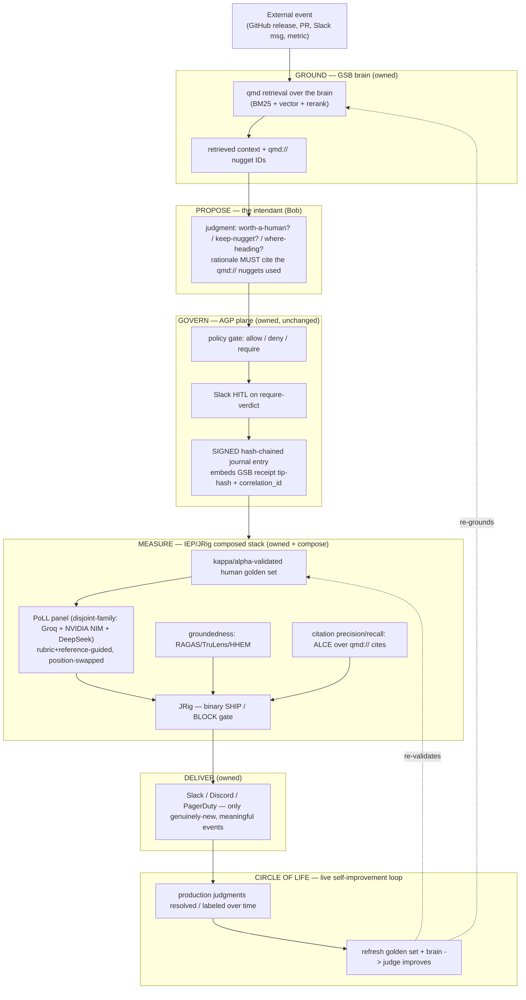

# 108 · AT · ARCH — The Governed Judgment Layer (living, self-improving governed judgment)

| Field | Value |
| --- | --- |
| **Date** | 2026-07-12 |
| **Author** | Jeremy Longshore |
| **Status** | **DESIGN — for ISEDC ratification** (`109-AT-DECR`). Non-normative until ratified. **No feature code in this phase.** |
| **Category** | AT-ARCH (architecture / technical design) |
| **Evidence base** | `107-RA-ANLY-governed-judgment-prior-art-and-method-stack` (cited method stack + competitive read) |
| **Governing / constrained-by** | AGP `001-AT-DECR` (no public surface until defensible) · AGP `050-AT-DECR` (Q5 locked / ACS gated) · intent-os `030-AT-DECR` (dark-until-Slice-0-green, naming) · AGP `MARKETING_CLAIMS.md` (claim-control) · `030-AT-DECR` (intent-os) "model proposes; deterministic system decides + records" |
| **Composes (owned assets)** | AGP (governance plane + signed journal) · GSB / ICO-INTKB-qmd (brain) · IEP / JRig + `@intentsolutions/core` (measurement) · Evidence Bench (signing rail) · NEXUS (working grounded-judgment precedent) |
| **Home for the ratified build** | the **public `jeremylongshore/bob-the-intendant`** repo (composes the kernels; ships an agent, not a second plane) |

---

## 1. Thesis (one paragraph)

A **governed judgment** is a decision an agent makes about the world — "is this external event
worth a human?", "keep this nugget?", "where is this heading?" — that is **(a) grounded** in a
living brain of the operator's world, **(b) cited** to the specific brain nuggets it relied on,
**(c) recorded** on a signed, hash-chained audit trail cross-linked to what the agent knew at
decision time, and **(d) measured** for quality by a composed evaluation stack that is itself
validated against a human golden set. No shipping product does all four. The three capabilities that
make it possible — **govern (AGP)**, **ground (GSB)**, **measure (IEP/JRig)** — are already owned and
map onto the wedge 1:1. This document specifies how they compose into **living, self-improving
governed judgment**, built in two layers (proven core first, research-grade forward-looking second)
and kept honest by a **live** self-improvement loop (the Circle of Life).

---

## 2. Layering (authoritative — corrects the earlier "Intendants = the plane" wording)

| Element | Role | Disposition |
| --- | --- | --- |
| **AGP** | **The governance PLANE** — the kernel that gates every action (`allow`/`deny`/`require`), sandboxes execution, and signs the hash-chained audit log. THE plane. The engine. | **Unchanged, not renamed.** |
| **GSB** (ICO + INTKB + qmd) | **The brain** — the living, governed context of the operator's world (people, places, things, work); grounds every judgment. | Compose. Sole memory/state foundation. |
| **IEP / JRig** + `@intentsolutions/core` | **Judgment measurement** — the moat. Binary ship/block gate + the schemas that make the eval pack a first-class artifact. | Compose (+ a candidate JRig upgrade — §8). |
| **An "intendant"** | **A governed agent that runs ON the AGP plane** (consistent with AGP's existing use of "intendant" = the adapter driving an agent). | Concept, not a new plane. |
| **Bob** | **The flagship intendant** — Jeremy's personal business partner; grounded in GSB; cited + measured + self-improving. The product. | **Bob v3.** v1/v2 harvested (§9). |
| **`bob-the-intendant`** | The **public** repo/product that houses Bob and everything to run him: composes AGP (plane) + GSB (brain) + IEP (eval) + the Circle-of-Life loop. | Bob runs **on** the AGP plane; it is **not** itself a second plane. |

**Positioning line held throughout:** *the AGP governance plane — and the intendants (like Bob) that
run on it — sits **above** any harness. It gates every action and grounds & measures the judgment.
It is a **complement** to the labs' agent SDKs (Google ADK, Claude Agent SDK, OpenAI Agents SDK),
**not a competitor** to them.* Background agents get **built with** existing harnesses and
**governed + judged by** us. (This is the LEAD QUESTION the council must ratify — §10.)

---

## 3. The governed-judgment loop (architecture)

**Invariant (fail-closed, inherited from AGP):** a judgment that cannot be grounded (no retrievable
context), cannot be cited, or cannot be journaled is **rejected, never partially processed**.

---

## 4. Brain-grounding (how qmd feeds the judge)

1. **Retrieve.** For each incoming event, qmd retrieves the relevant brain context over the GSB
   (BM25 + vector + rerank). The retrieved set carries **`qmd://` nugget identifiers**.
2. **Propose (cite-required).** The intendant produces a judgment **whose rationale must cite the
   `qmd://` nuggets it relied on.** A judgment with no citation to retrieved context is treated as
   ungrounded and is a candidate for BLOCK (measured by ALCE citation precision/recall — §6).
3. **Decide + record (deterministic).** The **model proposes; the deterministic system decides and
   records** — AGP's founding constraint, preserved verbatim. The judgment is a *proposal*; the AGP
   gate + the deterministic golden-score own the decision and the durable record. No model ever
   authorizes its own action or grades its own correctness as authority.
4. **Precedent to study:** **NEXUS** already does policy-gated LLM/embedding calls + citation-verify
   with **refusal-in-code** + hash-chained audit. It is a working grounded-judgment precedent; the
   design should mine its refusal-in-code pattern rather than reinvent it.

---

## 5. The composed evaluation stack (NOT JRig alone)

Per `107-RA-ANLY` §1.2, a single LLM judge tops out ~55% on hard grounded decisions. The grader is a
**composition**, and **JRig is the binary gate on top** of it — never the whole measurement:

| # | Component | Method (cited in `107`) | Answers |
| --- | --- | --- | --- |
| 1 | **Human golden set** | ≥2 annotators; report **κ / α**; precision/recall/F1 + **pass^k** | "what is the ground truth, and how reliable are the labels?" |
| 2 | **Groundedness** | RAGAS-faithfulness / TruLens-triad + **HHEM** independent classifier | "is the rationale grounded in retrieved context, or hallucinated?" |
| 3 | **Citation accuracy** | **ALCE** precision/recall over the `qmd://` cites | "did it cite the nuggets it actually used, correctly?" |
| 4 | **PoLL judge panel** | **disjoint-family** (Groq + NVIDIA NIM + DeepSeek), rubric+reference-guided, position-swapped | "graded quality of the judgment" (7× cheaper, less self-preference bias) |
| 5 | **JRig gate** | binary **SHIP / BLOCK** on the composed signal | "does this judgment deploy or not?" |

**Non-negotiable ordering constraint (from the pre-council roundtable, §11):** the deterministic
golden score is a **fact**; the PoLL-panel score is **another probabilistic guess**. **Never conflate
them.** Report them as separate columns; the golden set validates the panel, the panel does not
replace the golden set.

**Anti-theater constraint (unanimous roundtable guardrail):** the golden set must be a **LIVE
PIPELINE, not a static file** ("static file = eval theater with a hash chain"). Judge versions are
pinned; the judges are themselves evaluated; sampling controls cost. The live pipeline is the Circle
of Life (§7).

---

## 6. Governance of the judgment itself (the defensible wedge)

This is what nobody else ships. Every relevance verdict is:

- **Cited** — to the `qmd://` brain nuggets it relied on (§4).
- **Hash-chained** — written to AGP's signed journal. **Cross-chain causal pointer (invariant):**
  each AGP action-entry **embeds the GSB receipt tip-hash observed at decision time** plus a shared
  **`correlation_id`**. Without it, "what did Bob know when it acted X?" is unanswerable, and every
  run recorded before the field exists is permanently unprovable. **This field must exist from the
  first run.**
- **Measured** — by the composed stack (§5), with the measurement itself validated against a human
  golden set.

Two hash chains, one run: AGP's journal ("what it did") and GSB's receipt ("what it knew"). The
cross-chain pointer binds them so the pair reconstructs *knowledge → action* provenance. `agp verify`
plus `ico audit verify` must both be green **and** the pointer must reconstruct "what it knew at action
X" — this is the Slice-0-style acceptance proof for the judgment layer.

**Three design-in-from-day-one invariants (cheap now, unrecoverable later):**

1. **Cross-chain causal pointer** (above) — Epic-8 lineage.
2. **Liveness supervisor / dead-man's-switch** — unattended judgment agents fail *silently*
   (alive-but-stuck / dead-and-unnoticed). Heartbeat + restart-intensity bounds + escalate-on-silence,
   first-class (Jeremy already runs this reflex as `automation-liveness-sweep.sh`).
3. **Human commit gate on inferred specs** — a model may *propose* an agent spec / a permission set;
   a human **deterministically commits** it before it reaches the policy gate. The governance kernel
   exists to *check* permissions, so a model must never *infer them as authority*.

---

## 7. The Circle of Life (candidate core pillar — live self-improvement)

Harvested from Bob's Brain v1's bidirectional continuous-learning loop (every production interaction
fed back → pattern-recognised → looped back to improve Bob). This is **exactly the mechanism the
pre-council roundtable said the eval moat requires** to avoid being theater.

- **Layer-1 loop:** production judgments get **resolved / labeled** over time → **refresh the golden
  set + the brain** → the judge improves. This is the *live* pipeline, not a fixture.
- **Layer-2 loop:** the forward-looking Brier / U-calibration score **resolves over time** — a Circle
  of Life by another name ("keep the nugget; the loop tells you later if it paid off").

Elevating this turns "governed judgment" (a snapshot) into **living, self-improving governed
judgment** grounded in the operator's world. Jeremy's north star (2026-07-12) **elevates it from
candidate to core pillar**; the council ratifies whether it is a first-class pillar or a Layer-2
mechanism.

---

## 8. Two build layers (scope = the bold whole; build order = proven core first)

- **Layer 1 — Governed grounded-judgment eval (PROVEN, unblocked, ships value).** Watcher/Bob
  judgment grounded via qmd retrieval + measured with the composed stack (§5). Differentiated
  *today*; low technical risk. **This is the ratified first build bead (`iel-25a.4`).**
- **Layer 2 — Forward-looking + serendipity nuggets (NOVEL, research-grade).** Weak-signal maps
  (Yoon / BERTopic) for "where is this heading" + surprise-novelty memory-worthiness for "keep this
  nugget" + **Brier / U-calibration deferred scoring**. Genuinely open territory — a citable
  contribution; harder, longer.
- **Layer 3 — Positioning (not code).** An Evidence-Bench-published "governed judgment" scorecard +
  a writeup could claim the category. **Gated** by the claim-discipline + Q5 rules (§10).

**Scope decision (Jeremy, 2026-07-12): the ambitious whole (Layers 1+2), not Layer-1-only** — but
**build Layer 1 first** (per the DECR), on the watcher as the reference agent, then Bob.

---

## 9. Estate composition + JRig disposition

**Compose, do not rebuild.** Exact owned assets and their roles:

| Capability | Owned asset | Net-new? |
| --- | --- | --- |
| Gate every action + sign audit | **AGP** `mediate()` + journal (unchanged) | compose |
| Brain grounding + `qmd://` citations | **GSB** (ICO/INTKB/qmd) | compose |
| Binary ship/block gate + eval-pack schema | **IEP / JRig** + `@intentsolutions/core` | compose (+ upgrade) |
| Signed public proof bundles | **Evidence Bench** (live signing rail) | compose |
| Grounded-judgment precedent (refusal-in-code) | **NEXUS** | study/mine |
| Multi-provider disjoint-family judge wiring | **Bob v2** LiteLLM/BYOK design | harvest |

**JRig disposition — explicit:** JRig is **NOT replaced** and **NOT the whole answer.** It stays the
**binary ship/block gate**; it is *composed with* the proven grounded-eval stack. Formal
"JRig evaluates an agent EvalTarget" (RFC-043) stays **deferred / ISEDC-gated** — not needed for
Layer 1 (the judgment is graded as a prompt/classifier + external groundedness metrics). A candidate
**JRig upgrade** — add a **retrieval-context input** + a **groundedness criterion type** + **panel
support** — is a candidate IEP bead, **not a blocker**.

**Bob v1 / v2 reuse (patterns, not Google-locked code):** v1 (ADK/Vertex) → harvest R0–R4 tiers
(→ AGP allow/deny/require), evidence bundles (→ signed journal), the Circle-of-Life loop, foreman/
specialist org. v2 (BYOK/Pydantic-AI/LiteLLM/governed) → harvest the governance-kernel-consumer
design, `policy.yaml` R0–R4, sign-at-edge, immutable-memory-facts, "governed second brain" framing,
and **especially the LiteLLM/BYOK multi-provider wiring** (exactly what the disjoint-family judge
panel needs). **Bob v2 → ARCHIVED** (frozen with a pointer, as v1 was); no effort split across two
live Bobs.

---

## 10. Positioning, public-timing, and claim discipline (the council's ratification surface)

Jeremy has **decided** the following; the council **pressure-tests and ratifies the guardrails — it
does not re-litigate** the decisions:

- **Visibility = PUBLIC / build-in-the-open (OSS-first).** This is **on-thesis, not a reversal of the
  moat:** OSS/Apache-2.0 is **moat pillar #2** (vs incumbents' closed SaaS), so building
  `bob-the-intendant` in public **is** the OSS-first play. It **supersedes the *timing* lock** —
  `030-AT-DECR` "dark until Slice-0 green" and `001-AT-DECR` "no public surface until defensible" —
  recorded as a **deliberate supersession**, put to the council as its **first ratification**
  (public-now + what may we claim), **not** as a blocker.
- **Guardrail that now applies:** the public README/docs of `bob-the-intendant` fall under AGP's
  **claim-discipline** (`claim-scan`): **exactly one allowed security claim — "signed audit log of
  every tool call."** Stronger assurance terms (the `claim-scan` denylist: *tamper-evident/-proof,
  non-repudiable, forensic-/audit-/compliance-grade*) stay **banned** until a claim is registered in
  `MARKETING_CLAIMS.md` **and** CISO/GC-cleared. **"Build in public" ≠ "overclaim in public."**
- **Category play = yes:** product **and** a paper **and** an Evidence-Bench "governed judgment"
  scorecard — with the claim-discipline + the **Q5 line** (AGP `050-AT-DECR`: a *paper* on a novel
  composed method is fine; authoring a *rival spec/RFC* prematurely is **not**) ruled by the council.
- **Naming:** **Intendants → Bob the Intendant**; repo `intendants` → **`bob-the-intendant`** (flipped
  private→public). AGP unchanged. This is a product-naming change that requires a **small naming
  amendment to `030-AT-DECR`** (AGP unchanged; the "one allowed claim" + claim-discipline all carry
  over) — recorded as a **directive**, executed as a consequence of the ratified `109-AT-DECR`, not in
  this design-phase.

**The reconciliation the roundtable handed the council (§11):** ship **grounded, governed judgment
that visibly kills the noise** as the *felt product*; keep **eval/measurement as the internal
compounding moat + proof**, surfaced as *"tell me when judgment slips," NOT a dashboard*; governance
rides underneath as **plumbing/insurance**. Pitch **judgment-first, governance as plumbing.**

---

## 11. Pre-council roundtable inputs the design honors

Diverse panel (Karpathy, Chip Huyen, DHH, Rich Hickey + a solo indie hacker, a startup eng-manager, a
non-technical firm operator), 2026-07-12:

- **Q1 positioning — UNANIMOUS: a distinct layer ABOVE the harness, complement not compete.** "The
  harness question is settled: we are not a harness; hold that line."
- **Q2 which-half-is-the-moat:** the actual *users* pull toward **judgment** (anti-spam / trust);
  Karpathy calls measured judgment **"the whole ballgame"** (a compounding data asset); DHH's
  "cut judgment as v0 ceremony" is the minority — **right on the RISK** (no research-dashboard before
  a customer), **wrong on which half pulls.**
- **Three unanimous guardrails, encoded above:** (1) golden set = **live pipeline, not static file**;
  pin judge versions, eval the judges, sample for cost. (2) **Decompose "governance"** into
  decide / human-approve / record (Hickey); never conflate the deterministic golden score with the
  probabilistic panel score. (3) **Prove on ONE agent, small, boring correctness, weeks** — "trust is
  earned in boring correctness"; **pitch judgment-first, governance as plumbing.**

---

## 12. Definition of done for the ratified first layer (Layer 1 acceptance)

The build bead `iel-25a.4` is "done" when, on the reference agent (watcher → Bob):

1. Judgment is **grounded** (qmd retrieval) and **cites** the `qmd://` nuggets used.
2. The composed stack runs: golden set with reported **κ/α**; groundedness + ALCE citation scores;
   **PoLL panel** validated against the golden set; **JRig ship/block** gate on the composed signal.
3. Every verdict is **journaled with the cross-chain pointer** (GSB receipt tip-hash + `correlation_id`).
4. `agp verify` + `ico audit verify` both green **and** the pointer reconstructs "what it knew at
   action X."
5. The **deterministic golden score and the probabilistic panel score are reported as separate
   columns** (never conflated).
6. Consecutive triggers surface **only genuinely-new, meaningful events; zero duplicate alerts**
   (state/dedup via GSB).

**Standing gate (per slice):** *would Jeremy keep Bob running?* A "no" holds the widening.

---

## 13. Open questions routed to the ISEDC council (`109-AT-DECR`)

1. **LEAD — layer positioning:** ratify "plane ABOVE harnesses, complement not competitor; we do NOT
   build a harness." (CTO/CMO/CSO/GC)
2. **Public-timing supersession:** ratify the deliberate supersession of `030`/`001` dark-until-green
   by build-in-public/OSS-first; ratify the guardrails that make it safe. (CISO/GC/CMO)
3. **Scope/sequence:** Layers 1+2 (bold whole) with Layer-1-first — confirm. (CTO/CFO)
4. **Circle of Life:** core pillar vs Layer-2 mechanism. (CTO/CMO)
5. **Category play:** product + paper + Evidence-Bench scorecard — approve + set claim + Q5 line. (CMO/CSO/VP-DevRel)
6. **Claim discipline:** "governed judgment" public claim vs banned terms; `MARKETING_CLAIMS.md`-first. (CISO/GC)
7. **Bandwidth:** solo operator — right next bet vs shipping Layer 1 quietly. (CFO)
8. **IP/first-mover:** Glean/Fiddler/Notion encroachment risk (~12–18mo window → EU AI Act Aug 2026). (GC/CMO)
9. **Naming:** Intendants → Bob the Intendant; `bob-the-intendant`; Bob v3 flagship / v2 archived. (all)

---

*Filed under Document Filing Standard v4.4. Design for ratification; non-normative until `109-AT-DECR`. Bead: `iel-25a.2` (epic `iel-25a`).*
